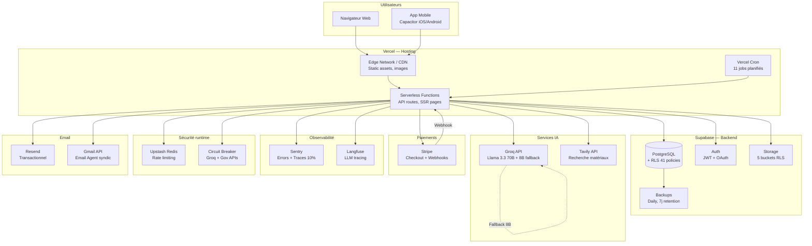
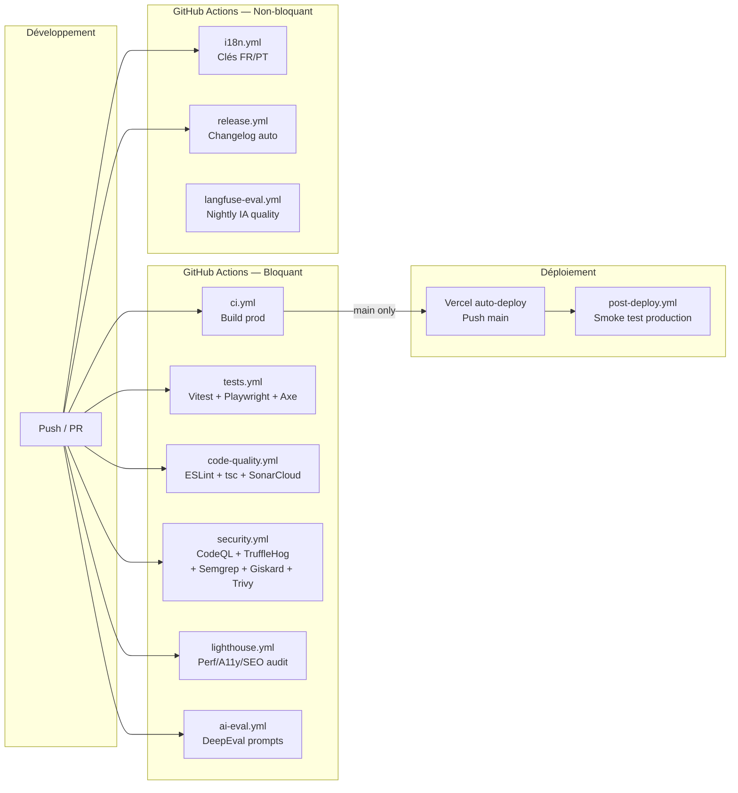

# Vitfix — Infrastructure & DevOps Diagram

> Dernière mise à jour : 5 avril 2026

---

## 1. Infrastructure de production



---

## 2. Pipeline CI/CD



---

## 3. Flux réseau & sécurité

```mermaid
graph TB
    subgraph Internet
        CLIENT[Client HTTP]
    end

    subgraph Edge["Vercel Edge"]
        TLS[TLS 1.3<br/>Auto-managed]
        CDN_CACHE[CDN Cache<br/>Static: 1 year immutable]
        MW[Middleware<br/>CSP + HSTS + CSRF + i18n + RBAC]
    end

    subgraph App["Application"]
        RATE[Rate Limiter<br/>Upstash Redis<br/>20 req/60s default]
        VALID[Validation<br/>Zod schemas]
        SANIT[Sanitization<br/>DOMPurify]
        API[API Route Handler]
    end

    subgraph DB["Base de données"]
        RLS[Row-Level Security<br/>auth.uid() checks]
        PG2[(PostgreSQL)]
    end

    CLIENT -->|HTTPS| TLS
    TLS --> CDN_CACHE
    CDN_CACHE -->|Dynamic| MW
    MW --> RATE
    RATE -->|429 si dépassé| CLIENT
    RATE --> VALID
    VALID --> SANIT
    SANIT --> API
    API -->|service_role + RLS| RLS
    RLS --> PG2
```

---

## 4. Headers de sécurité

| Header | Valeur |
|--------|--------|
| Content-Security-Policy | `default-src 'self'; script-src stripe.com, vercel, sentry` |
| Strict-Transport-Security | `max-age=63072000; includeSubDomains; preload` |
| X-Content-Type-Options | `nosniff` |
| X-Frame-Options | `DENY` |
| X-XSS-Protection | `1; mode=block` |
| Referrer-Policy | `strict-origin-when-cross-origin` |
| Permissions-Policy | camera, microphone, geolocation restricted |

---

## 5. Cron jobs

| Job | Fréquence | Route |
|-----|-----------|-------|
| Health check | Daily 6h | `/api/health` |
| Email agent poll | Daily 8h | `/api/email-agent/poll` |
| Referral sync | Daily 2h | `/api/cron/referral` |
| Tender scan | Lundi 5h | `/api/tenders/scan` |
| DECP sync | Lundi 7h | `/api/sync/decp-13` |
| SITADEL sync | Lundi 7h | `/api/sync/sitadel-13` |
| Mairies sync | Lundi 7h30 | `/api/sync/mairies-13` |
| Base GOV PT | Lundi 8h | `/api/sync/base-gov-pt` |
| TED Porto | Lundi 8h30 | `/api/sync/ted-porto` |
| Obras Porto | Lundi 9h | `/api/sync/obras-porto` |

---

## 6. Métriques de résilience

| Composant | Stratégie | Config |
|-----------|-----------|--------|
| Groq API | Circuit breaker + model fallback | 5 failures → open, 30s reset, 70B → 8B |
| Gov APIs | Circuit breaker | 3 failures → open, 60s reset |
| Rate limiting | Upstash Redis + in-memory fallback | 20 req/60s, fallback 10k entries max |
| DB backups | Supabase auto | Daily, 7j retention |
| Code rollback | Vercel promote | Manuel via dashboard |
