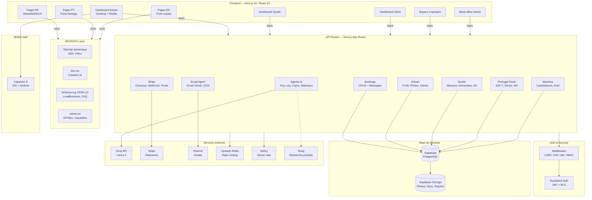

# Vitfix — Schema d'organisation interne

> Derniere mise a jour : 18 mars 2026
> Genere depuis l'analyse du code source reel du projet.

---

## 1. Vue d'ensemble



---

## 2. Structure des dossiers (reelle)

```
fixit-production/
├── app/                              <- Pages Next.js (App Router)
│   ├── fr/                           <- Marche France (Marseille/PACA)
│   │   ├── services/[slug]/          <- 90 pages service x ville
│   │   ├── urgence/[slug]/           <- 90 pages urgence x ville
│   │   ├── ville/[slug]/             <- 18 pages ville
│   │   ├── pres-de-chez-moi/[slug]/  <- 95 pages "near me"
│   │   ├── blog/[slug]/              <- Articles FR
│   │   ├── specialites/              <- 6 niches PACA
│   │   ├── copropriete/              <- B2B copropriete
│   │   ├── simulateur-devis/[city]/  <- Simulateur par ville
│   │   └── ...                       <- comment-ca-marche, devenir-partenaire
│   ├── pt/                           <- Marche Portugal
│   │   ├── services/[slug]/          <- Pages service x ville PT
│   │   ├── urgencia/[slug]/          <- Urgences PT
│   │   ├── cidade/[slug]/            <- Pages ville PT
│   │   └── blog/[slug]/              <- Articles PT
│   ├── en/[slug]/                    <- 9 pages Porto expats
│   ├── es/[slug]/                    <- 4 pages investisseurs ES
│   ├── nl/[slug]/                    <- 4 pages investisseurs NL
│   ├── servicos/[slug]/              <- Pages PT (root-level, 96 combos)
│   ├── urgencia/[slug]/              <- Urgences PT (root-level)
│   ├── cidade/[slug]/                <- Villes PT (root-level)
│   ├── perto-de-mim/[slug]/          <- Near-me PT (root-level)
│   ├── pro/                          <- Espace artisan
│   │   ├── dashboard/                <- Dashboard principal (~3800 lignes)
│   │   ├── mobile/                   <- App mobile (Capacitor)
│   │   ├── register/ + login/        <- Auth artisan
│   │   ├── tarifs/ + faq/            <- Pages info
│   ├── syndic/                       <- Espace syndic
│   │   ├── dashboard/                <- Dashboard syndic complet
│   │   ├── register/ + login/        <- Auth syndic
│   │   └── invite/                   <- Invitation equipe
│   ├── client/dashboard/             <- Dashboard client
│   ├── coproprietaire/               <- Espace coproprio
│   │   ├── dashboard/ + portail/
│   ├── admin/                        <- Back-office
│   │   ├── dashboard/ + login/
│   ├── marches/                      <- Bourse aux marches
│   │   ├── publier/ + gerer/
│   ├── artisan/[id]/                 <- Profil public artisan
│   ├── auth/                         <- Auth globale
│   │   ├── login/ + register/
│   │   ├── reset-password/ + update-password/
│   ├── api/                          <- 40+ groupes de routes API
│   │   ├── bookings/                 <- CRUD reservations
│   │   ├── booking-messages/         <- Messagerie reservation
│   │   ├── artisan-*/                <- 6 routes artisan
│   │   ├── artisans/ + artisans-catalogue/
│   │   ├── syndic/                   <- 16 sous-routes syndic
│   │   │   ├── missions/ + artisans/ + signalements/
│   │   │   ├── immeubles/ + coproprios/ + assemblees/
│   │   │   ├── planning-events/ + team/ + messages/
│   │   │   ├── fixy-syndic/ + lea-comptable/ + max-ai/
│   │   │   ├── import-gecond/ + send-email/ + invite/
│   │   │   └── canal-interne/ + mission-report/ + notify-artisan/
│   │   ├── fixy-ai/ + fixy-chat/     <- Agent IA Fixy
│   │   ├── comptable-ai/             <- Agent IA Lea
│   │   ├── copro-ai/                 <- Agent IA copro
│   │   ├── materiaux-ai/             <- Agent IA materiaux
│   │   ├── email-agent/              <- Agent email Gmail
│   │   │   ├── action/ + callback/ + classify/
│   │   │   ├── connect/ + ocr/ + poll/
│   │   ├── stripe/                   <- Paiements
│   │   │   ├── checkout/ + portal/ + subscription/ + webhook/
│   │   ├── marches/ + marches/[id]/  <- Bourse marches
│   │   ├── portugal-fiscal/          <- Compliance PT
│   │   │   ├── register-document/ + saft-export/ + series/
│   │   ├── pro/channel/ + pro/messagerie/
│   │   ├── availability/ + availability-services/
│   │   ├── tracking/[token]/ + tracking/update/
│   │   ├── upload/ + wallet-sync/ + health/
│   │   ├── user/delete-account/ + user/export-data/ + user/export-csv/
│   │   └── verify-id/ + verify-siret/ + verify-nif/
│   ├── sitemap.ts                    <- Sitemap dynamique (550+ URLs)
│   ├── robots.ts                     <- robots.txt (AI crawlers autorises)
│   └── layout.tsx + globals.css      <- Root layout + styles
│
├── components/                       <- Composants React partages
│   ├── DevisFactureForm.tsx          <- Generation PDF devis/factures (141 KB)
│   ├── ArtisansCatalogueSection.tsx  <- Catalogue artisans
│   ├── chat/                         <- Composants chat
│   ├── common/                       <- Header, Footer, CookieConsent, etc.
│   ├── dashboard/                    <- Sections du dashboard artisan
│   │   ├── ComptabiliteSection.tsx   <- Espace comptabilite
│   │   ├── MateriauxSection.tsx      <- Agent materiaux
│   │   ├── ClientsSection.tsx        <- Gestion clients
│   │   ├── RapportsSection.tsx       <- Rapports chantier
│   │   ├── CalendarSection.tsx       <- Agenda
│   │   ├── DevisSection.tsx + FacturesSection.tsx
│   │   ├── MessagerieArtisan.tsx     <- Chat pro
│   │   ├── PhotosChantierSection.tsx <- Proof of Work
│   │   ├── StatsRevenusSection.tsx   <- Stats financieres
│   │   ├── WalletConformiteSection.tsx <- Documents pro
│   │   └── SettingsSection.tsx + HorairesSection.tsx
│   ├── syndic-dashboard/             <- Composants syndic
│   │   ├── governance/               <- AG, votes, PV
│   │   ├── misc/                     <- Marches, signalements
│   │   └── ...
│   ├── investor/                     <- Pages investisseurs
│   ├── marches/                      <- Composants marches
│   ├── ui/                           <- Composants UI generiques
│   └── en/                           <- Composants EN
│
├── lib/                              <- Logique metier et utilitaires
│   ├── supabase.ts                   <- Client browser (respecte RLS)
│   ├── supabase-server.ts            <- Client admin (bypass RLS)
│   ├── supabase-server-component.ts  <- Client Server Components
│   ├── auth-helpers.ts               <- getAuthUser(), verification roles
│   ├── validation.ts                 <- Schemas Zod (23 KB)
│   ├── sanitize.ts                   <- DOMPurify, anti-XSS
│   ├── rate-limit.ts                 <- checkRateLimit() via Upstash
│   ├── logger.ts                     <- Logger structuré
│   ├── groq.ts                       <- Client Groq (Llama 3)
│   ├── stripe.ts                     <- Client Stripe
│   ├── email.ts                      <- Client Resend
│   ├── notifications.ts              <- Capacitor push notifications
│   ├── constants.ts                  <- Telephones, URLs, timeouts
│   ├── utils.ts                      <- formatPrice(), etc.
│   ├── env.ts                        <- Variables d'environnement typées
│   ├── audit.ts                      <- Audit logging
│   ├── financial.ts                  <- Calculs financiers
│   ├── idempotency.ts                <- Deduplication requetes
│   ├── portugal-fiscal.ts            <- Compliance fiscale PT (18 KB)
│   ├── saft-pt.ts                    <- Generation XML SAF-T (20 KB)
│   ├── gecond-parser.ts              <- Parser import GECond syndic
│   ├── geo.ts                        <- Geolocalisation
│   ├── password-policy.ts            <- Regles mot de passe
│   ├── subscription.ts               <- Gestion abonnements
│   ├── database.types.ts             <- Types Supabase auto-generes (35 KB)
│   ├── data/                         <- Donnees SEO
│   │   ├── fr-seo-pages-data.ts      <- 20 services x 19 villes FR
│   │   ├── seo-pages-data.ts         <- Services x villes PT
│   │   ├── en-services-data.ts       <- 9 services EN
│   │   ├── investor-pages-data.ts    <- Pages investisseurs (FR/ES/NL)
│   │   └── fr-blog-data.ts           <- Articles blog FR
│   └── i18n/                         <- Traductions
│
├── middleware.ts                      <- CSRF + CSP + i18n + RBAC
├── instrumentation.ts                <- Sentry server-side init
├── sentry.client.config.ts           <- Sentry client (replay desactive)
├── next.config.ts                    <- Config Next.js
├── capacitor.config.ts               <- Config Capacitor (com.fixit.artisan)
│
├── supabase/                         <- Migrations et config
│   └── migrations/                   <- 13 fichiers SQL
│
├── scripts/                          <- Scripts utilitaires
│   ├── seed-artisan.ts + seed-client.ts
│   ├── import-artisans-*.mjs         <- Import batch artisans
│   └── create-agenda-tables.ts
│
├── tests/                            <- Tests unitaires (Vitest)
│   ├── lib/                          <- Tests utilitaires
│   ├── api/                          <- Tests API
│   └── mocks/                        <- Mocks Supabase
│
├── e2e/                              <- Tests E2E (Playwright)
│
├── public/                           <- Assets statiques
│   ├── llms.txt                      <- Fichier pour crawlers IA
│   ├── manifest.json                 <- PWA manifest
│   ├── og-image.png                  <- Open Graph
│   └── icon-192.png + icon-512.png
│
├── product/                          <- Documentation produit
│   ├── roadmap.md + bugs.md + decisions.md
├── marketing/                        <- Marketing
│   ├── ads/ + social-media/
├── business/                         <- Strategie
│   ├── competitors.md + growth-ideas.md
├── clients/                          <- Relation clients
│   ├── onboarding/ + templates-emails/ + faq-responses/
├── seo-portugal/                     <- Strategie SEO PT
│   ├── CLAUDE.md + context/ + Content/ + Keywords/
└── CLAUDE.md                         <- Instructions dev IA
```

---

## 3. Flux de donnees principaux

### Flux 1 — Reservation client -> Artisan

```
Client cherche un artisan
  -> /recherche (filtres ville, categorie, disponibilite)
    -> /artisan/[id] (fiche publique avec Schema.org)
      -> /reserver (formulaire de reservation)
        -> POST /api/bookings (validation Zod + checkRateLimit)
          -> Insert DB table `bookings` (status: pending)
            -> Insert `artisan_notifications` (notification push)
              -> Artisan voit dans /pro/dashboard onglet Interventions
                -> Artisan accepte/refuse
                  -> Update `bookings.status`
                    -> Insert `booking_messages` (echange client-artisan)
                      -> Mirror vers `conversations` + `conversation_messages`
```

### Flux 2 — Inscription artisan

```
Artisan s'inscrit
  -> /pro/register (formulaire + upload SIRET ou NIF)
    -> POST /api/auth/register (Supabase Auth, role: artisan)
      -> Insert `profiles_artisan` (company_name, categories, city)
        -> /pro/dashboard accessible (middleware RBAC)
          -> Upload RC Pro / Decennale dans /api/upload
            -> wallet-sync -> met a jour syndic_artisans lies
              -> Profil visible sur /artisan/[id] avec JSON-LD
                -> Sitemap.ts inclut /artisan/[slug]/
                  -> Indexation Google + crawlers IA
```

### Flux 3 — Crawl IA (SEO/GEO)

```
Bot IA (GPTBot, ClaudeBot, PerplexityBot, Applebot-Extended)
  -> robots.txt -> autorise (sauf /api/, /admin/, /pro/)
    -> /llms.txt -> contexte Vitfix lu (mission, services, villes)
      -> /fr/services/plombier-marseille -> page crawlee
        -> Schema.org JSON-LD parse :
          -> HomeAndConstructionBusiness
          -> AggregateRating (note + avis)
          -> FAQPage (5 questions/reponses)
          -> BreadcrumbList (navigation)
            -> Vitfix cite dans reponses IA
```

### Flux 4 — Mission syndic -> Artisan

```
Syndic cree un signalement
  -> POST /api/syndic/signalements
    -> Insert DB `syndic_signalements`
      -> Syndic assigne une mission
        -> POST /api/syndic/assign-mission
          -> Insert `syndic_missions` (status: assigned)
            -> POST /api/syndic/notify-artisan (email Resend)
              -> Artisan voit dans /pro/dashboard
                -> Artisan complete la mission + rapport photo
                  -> POST /api/syndic/mission-report
                    -> Update `syndic_missions` (status: completed)
```

### Flux 5 — Paiement abonnement Stripe

```
Artisan/Syndic clique "S'abonner"
  -> POST /api/stripe/checkout (cree Stripe Checkout Session)
    -> Redirect vers Stripe hosted checkout
      -> Client paie
        -> Stripe envoie webhook -> POST /api/stripe/webhook
          -> Verification signature whsec_
            -> Insert/Update `subscriptions`
              -> user_metadata.subscription_status = 'active'
                -> Fonctionnalites premium debloquees
```

---

## 4. Modele de donnees (tables Supabase)

### Tables principales

```
profiles_artisan
  id (uuid PK), user_id (FK auth.users)
  company_name, slug, bio
  categories[] (text[]), specialites[] (text[])
  company_city, company_address, latitude, longitude
  country ('FR' | 'PT'), language ('fr' | 'pt' | 'en')
  phone, email, siret, nif
  rating_avg (float), rating_count (int)
  profile_photo_url, active (bool)
  rc_pro_url, rc_pro_expiry
  created_at, updated_at

bookings
  id (uuid PK)
  client_id (FK auth.users), artisan_id (FK profiles_artisan)
  service, date, time_slot, address
  status ('pending' | 'confirmed' | 'in_progress' | 'completed' | 'cancelled')
  price, notes
  created_at, updated_at

booking_messages
  id (uuid PK), booking_id (FK bookings)
  sender_id (FK auth.users), sender_role ('client' | 'artisan' | 'system')
  sender_name, content, type ('text' | 'photo' | 'voice' | 'devis_sent' | 'devis_signed')
  attachment_url, metadata (jsonb), read_at
  created_at

conversations
  id (uuid PK), artisan_id (FK auth.users), contact_id (FK auth.users)
  contact_type, contact_name, contact_avatar
  last_message_at, last_message_preview, unread_count

conversation_messages
  id (uuid PK), conversation_id (FK conversations)
  sender_id, type, content, metadata (jsonb), read (bool)

services
  id (uuid PK), artisan_id (FK profiles_artisan)
  name, description, price_ttc, duration_minutes
  active (bool)
```

### Tables syndic

```
syndic_team_members
  id, user_id, cabinet_id, role, email, full_name

syndic_artisans
  id, cabinet_id, artisan_user_id, email
  company_name, specialites[], phone, city
  rc_pro_valide, rc_pro_expiration
  assurance_decennale_valide, assurance_decennale_expiration
  note_interne, rating_interne

syndic_immeubles
  id, cabinet_id, nom, adresse, ville, nb_lots
  syndic_reference, gestionnaire

syndic_coproprios
  id, cabinet_id, immeuble_id
  nom, prenom, email, telephone, lot_numero, quote_part

syndic_signalements
  id, cabinet_id, immeuble_id
  titre, description, priorite, statut
  photos[], signaleur_nom, signaleur_email

syndic_missions
  id, cabinet_id, signalement_id, artisan_id
  titre, description, statut, montant_estime
  date_debut, date_fin, rapport_photos[]

syndic_assemblees
  id, cabinet_id, immeuble_id
  type ('ordinaire' | 'extraordinaire'), date, lieu
  statut, quorum_atteint, pv_url

syndic_planning_events
  id, cabinet_id, title, date, type, immeuble_id

syndic_notifications
  id, user_id, type, title, body, read, data_json
```

### Tables marketplace

```
marches
  id, auteur_id, titre, description
  metier, ville, budget_min, budget_max
  date_limite, statut, candidatures_count

marches_candidatures
  id, marche_id, artisan_id
  message, montant_propose, statut, fichiers[]

marches_messages
  id, marche_id, sender_id, content
```

### Tables financieres

```
subscriptions
  id, user_id, stripe_customer_id, stripe_subscription_id
  plan, status, current_period_start, current_period_end

pt_fiscal_series
  id, user_id, type ('FT' | 'FR' | 'NC'), prefix, current_number

pt_fiscal_documents
  id, user_id, series_id, document_number
  type, client_nif, total_amount, tax_amount, hash
```

---

## 5. Variables d'environnement

```bash
# === REQUISES ===

# Supabase
NEXT_PUBLIC_SUPABASE_URL=https://xxx.supabase.co
NEXT_PUBLIC_SUPABASE_ANON_KEY=eyJ...
SUPABASE_SERVICE_ROLE_KEY=eyJ...          # JAMAIS cote client

# App
NEXT_PUBLIC_APP_URL=https://vitfix.io     # Canonicals, OAuth redirects

# IA
GROQ_API_KEY=gsk_...                      # Llama 3 (Fixy, Lea, Copro, Materiaux)

# Admin
ADMIN_EMAIL=admin@vitfix.io
CRON_SECRET=xxx                           # Auth cron jobs

# Email
RESEND_API_KEY=re_...                     # Envoi emails

# === OPTIONNELLES ===

# Google OAuth (agent email syndic)
GOOGLE_CLIENT_ID=xxx.apps.googleusercontent.com
GOOGLE_CLIENT_SECRET=GOCSPX-xxx

# Stripe (abonnements)
STRIPE_SECRET_KEY=sk_live_...
STRIPE_PUBLISHABLE_KEY=pk_live_...
STRIPE_WEBHOOK_SECRET=whsec_...
STRIPE_PRICE_ARTISAN_PRO=price_...
STRIPE_PRICE_SYNDIC_ESSENTIAL=price_...
STRIPE_PRICE_SYNDIC_PREMIUM=price_...

# Rate limiting
UPSTASH_REDIS_REST_URL=https://xxx.upstash.io
UPSTASH_REDIS_REST_TOKEN=AX...

# Recherche produits
TAVILY_API_KEY=tvly-...

# Chiffrement tokens OAuth
ENCRYPTION_KEY=xxx                        # AES, 32+ chars

# Monitoring
NEXT_PUBLIC_SENTRY_DSN=https://xxx@sentry.io/xxx
SENTRY_AUTH_TOKEN=sntrys_...
```

---

## 6. Conventions de code

### Nommage

| Element | Convention | Exemple |
|---------|-----------|---------|
| Pages | kebab-case dossiers | `app/pro/dashboard/page.tsx` |
| Composants | PascalCase | `ComptabiliteSection.tsx` |
| Lib/utils | camelCase | `auth-helpers.ts`, `formatPrice()` |
| Routes API | kebab-case | `/api/booking-messages/route.ts` |
| Tables DB | snake_case | `profiles_artisan`, `booking_messages` |
| Env vars | SCREAMING_SNAKE | `GROQ_API_KEY` |

### Architecture

- **Dashboard artisan monolithique** : `app/pro/dashboard/page.tsx` (~3800 lignes) contient tous les sous-composants inline. Sections extraites progressivement dans `components/dashboard/`.
- **1 route API = 1 fichier** : chaque `route.ts` exporte GET/POST/PATCH/DELETE.
- **3 clients Supabase** :
  - `lib/supabase.ts` = browser (RLS)
  - `lib/supabase-server.ts` = admin (bypass RLS, server-side only)
  - `lib/supabase-server-component.ts` = Server Components
- **Validation** : Zod schemas dans `lib/validation.ts`, appliques via `validateBody()`.
- **Rate limiting** : `checkRateLimit(key, count, windowMs)` sur toutes les routes sensibles.
- **Side effects non-bloquants** : `asyncHelper().catch(err => logger.error(...))` — les effets secondaires (notifications, mirrors) ne bloquent jamais la reponse HTTP.

### SEO (regles sacrees)

- Les URLs `/fr/` et `/pt/` ne doivent **jamais** changer (impact SEO critique).
- Toujours inclure `BreadcrumbList` + `FAQPage` en JSON-LD sur les pages service.
- Canonical URLs vers `vitfix.io` (jamais `vercel.app`).
- Portugais europeen uniquement : `canalizador` (pas `encanador`), `telemovel` (pas `celular`).

### Mobile (Capacitor)

- Imports **toujours dynamiques** : `await import('@capacitor/local-notifications')` pour eviter crash SSR.
- Guard mobile : `window.innerWidth <= 900 || 'ontouchstart' in window || Capacitor.isNativePlatform()`
- Config : `capacitor.config.ts` (appId: `com.fixit.artisan`)

---

## 7. Roles et acces (RBAC)

Le middleware route les utilisateurs selon leur role Supabase :

| Role | Dashboard | Acces |
|------|-----------|-------|
| `super_admin` | `/admin/dashboard` | Tout |
| `syndic_admin`, `syndic_gestionnaire`, `syndic_comptable` | `/syndic/dashboard` | Gestion coproprietes |
| `artisan` | `/pro/dashboard` | Profil, bookings, comptabilite |
| `pro_societe`, `pro_conciergerie`, `pro_gestionnaire` | `/pro/dashboard` | Idem artisan |
| `coproprio`, `locataire` | `/coproprietaire/dashboard` | Signalements, AG |
| Client (defaut) | `/client/dashboard` | Reservations, messages |

---

## 8. Regles de deploiement

### Branches

- `main` -> production (vitfix.io via Vercel, deploy auto)
- Pas de branche staging actuellement — deploy direct sur main

### Checklist avant merge

- [ ] `npm run build` sans erreur TypeScript
- [ ] `npm run lint` sans erreur (warnings OK)
- [ ] `npm run test` — 43+ tests passent
- [ ] Schemas JSON-LD valides sur les nouvelles pages SEO
- [ ] `sitemap.ts` mis a jour si nouvelles routes
- [ ] Variables `.env` documentees dans `.env.example`
- [ ] `supabaseAdmin` jamais importe cote client
- [ ] Rate limiting sur toutes les routes API sensibles
- [ ] Verification ownership (anti-IDOR) sur lectures/ecritures

### Deploiement

```bash
# Automatique via Vercel (push sur main)
git push origin main

# Manuel si necessaire
vercel --prod --yes
```

---

## 9. Ecarts avec le template initial

Le prompt de reference utilisait un schema generique (Prisma, NextAuth, Twilio). Voici les differences avec le projet reel :

| Template | Realite Vitfix |
|----------|---------------|
| Prisma ORM | Supabase JS client direct (pas d'ORM) |
| NextAuth | Supabase Auth (JWT natif + RLS) |
| PostgreSQL standalone | Supabase PostgreSQL (hosted + Storage + Auth) |
| SMTP / Twilio | Resend (email), Capacitor (push natif) |
| robots.txt statique | `robots.ts` dynamique (Next.js) |
| Structure standard | Dashboard monolithique + composants progressivement extraits |
| 1 marche | 5 marches (FR, PT, EN, ES, NL) |
| Pas d'IA | 4 agents IA (Fixy, Lea, Copro, Materiaux) + email agent |
| Pas de fiscal | Compliance fiscale Portugal (SAF-T, NIF, series) |
| Pas de marketplace | Bourse aux marches (candidatures, evaluations) |
