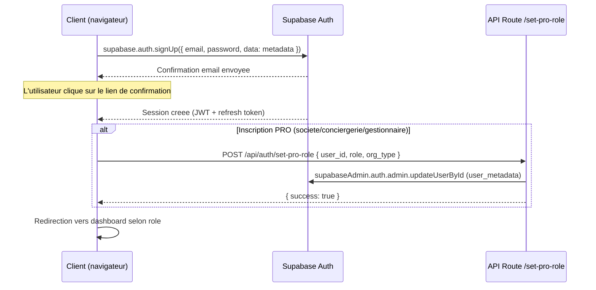
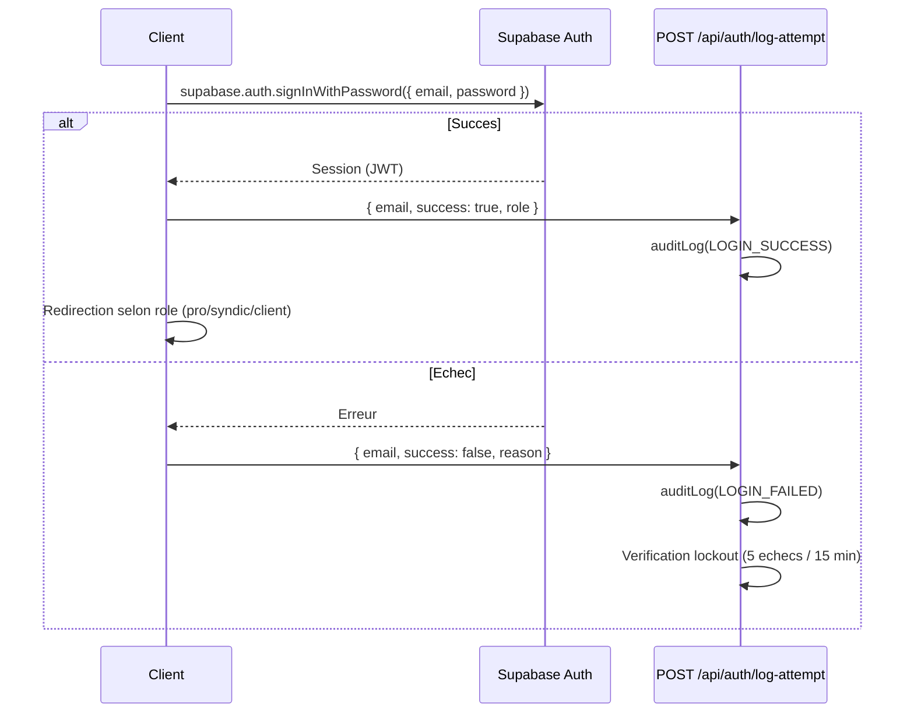
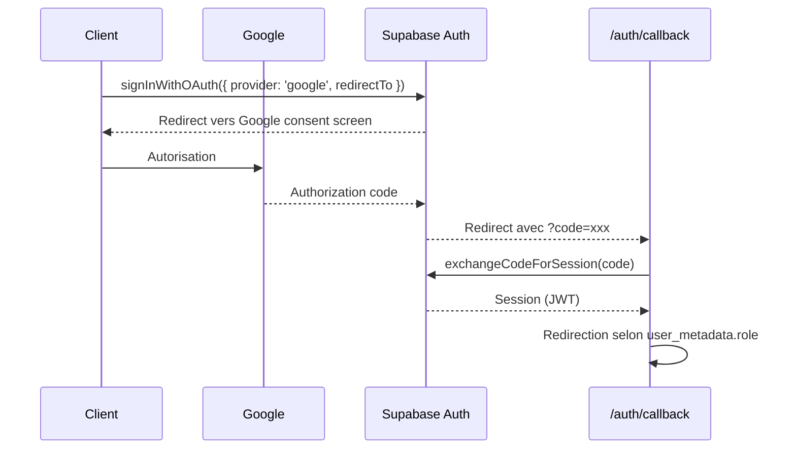

# Authentification & Securite

Documentation technique du systeme d'authentification et des mesures de securite de Vitfix.io.

**Derniere mise a jour :** avril 2026
**Stack :** Supabase Auth, Next.js 16, Upstash Redis, Vercel

---

## 1. Vue d'ensemble

Vitfix utilise **Supabase Auth** comme fournisseur d'identite. Deux methodes de connexion sont actives :

- **Email / mot de passe** : inscription avec confirmation email, login classique. Politique de mot de passe renforcee cote client (8 caracteres minimum, 1 majuscule, 1 minuscule, 1 chiffre).
- **Google OAuth** : connexion via `signInWithOAuth({ provider: 'google' })`. Reservee aux particuliers (espace client). Le callback redirige vers `/client/dashboard`.

Les sessions sont gerees par cookies HTTP-only via `@supabase/ssr`. Cote client, `createBrowserClient` gere automatiquement le stockage de session. Cote serveur, deux clients coexistent :

| Client | Fichier | Cle utilisee | RLS |
|--------|---------|--------------|-----|
| Browser | `lib/supabase.ts` | `anon_key` | Respecte |
| Server Component | `lib/supabase-server-component.ts` | `anon_key` + cookies | Respecte |
| Admin (API routes) | `lib/supabase-server.ts` | `service_role_key` | Bypass |

L'admin client (`supabaseAdmin`) bypass les policies RLS. Il est utilise uniquement dans les API routes cote serveur, jamais expose au navigateur.

---

## 2. Flux d'authentification

### 2.1 Inscription email/password



Les metadata transmises a l'inscription incluent : `full_name`, `phone`, `address`, `city`, `postal_code`, `role`. Pour les entreprises : `company_name`, `siret`, `company_verified`.

### 2.2 Connexion email/password



### 2.3 Google OAuth



Le callback (`app/auth/callback/route.ts`) inspecte `user_metadata.role` pour router vers `/pro/dashboard` (artisan, pro_societe, pro_conciergerie, pro_gestionnaire) ou `/client/dashboard`.

### 2.4 Reset de mot de passe

Le endpoint `POST /api/auth/reset-password` accepte un email, appelle `supabase.auth.resetPasswordForEmail()` avec un `redirectTo` vers `/auth/update-password`. Rate limit : 3 requetes par 5 minutes par IP.

---

## 3. Roles et permissions

### 3.1 Roles definis dans le code

Les roles sont stockes dans `user_metadata.role` (inscription) et dupliques dans `app_metadata.role` (mise a jour serveur). Les verifications de securite cote serveur font confiance uniquement a `app_metadata` car `user_metadata` est modifiable cote client.

| Role | Description | Verification |
|------|-------------|--------------|
| `artisan` | Artisan independant | `isArtisanRole()` |
| `pro_societe` | Societe de BTP | Via `user_metadata.role` |
| `pro_conciergerie` | Conciergerie | Via `user_metadata.role` |
| `pro_gestionnaire` | Gestionnaire immobilier | Via `user_metadata.role` |
| `syndic` | Syndic admin (cabinet principal) | `isSyndicRole()` |
| `syndic_*` | Employe syndic (sous-role) | `isSyndicRole()` detecte le prefixe |
| `super_admin` | Administrateur plateforme | `isSuperAdmin()` |
| *(vide)* | Particulier / client | Fallback par defaut |

### 3.2 Fonctions de verification (lib/auth-helpers.ts)

- **`getUserRole(user)`** : retourne `app_metadata.role` en priorite, fallback `user_metadata.role`.
- **`isSyndicRole(user)`** : `true` si role = `syndic`, `syndic_*`, ou `super_admin`.
- **`isSuperAdmin(user)`** : `true` uniquement si role = `super_admin`.
- **`isArtisanRole(user)`** : `true` si role = `artisan`.

### 3.3 Resolution du cabinet_id

Pour les syndics, chaque requete API doit determiner a quel cabinet l'utilisateur appartient. La fonction `resolveCabinetId()` gere cela :

- **Syndic admin** (`role = syndic` ou `super_admin`) : `cabinet_id = user.id`
- **Employe syndic** (`role = syndic_*`) : recherche dans la table `syndic_team_members` avec `is_active = true`

Le resultat est mis en cache en memoire pendant 5 minutes pour eviter des requetes DB repetees.

### 3.4 Verification d'ownership inter-tenant

La fonction `verifyCabinetOwnership(user, resourceCabinetId, supabaseAdmin)` verifie qu'une ressource appartient bien au cabinet de l'utilisateur. Cette verification est une defense en profondeur, appliquee meme si les RLS Supabase sont actives.

---

## 4. Supabase Auth cote client

### 4.1 Client navigateur

Fichier : `lib/supabase.ts`

```typescript
import { createBrowserClient } from '@supabase/ssr'

export const supabase = createBrowserClient(supabaseUrl, supabaseAnonKey, {
  cookieOptions: {
    // Cookies geres automatiquement par @supabase/ssr
  },
})
```

Le client est un singleton reutilise dans toute l'application. Il utilise la cle `anon_key` et respecte les policies RLS.

### 4.2 Gestion de session cote client

- **Verification de session au chargement** : les pages protegees appellent `supabase.auth.getSession()` et redirigent vers `/auth/login` si aucune session n'est trouvee.
- **Redirection apres login** : basee sur `user_metadata.role`. Les roles `artisan`, `pro_societe`, `pro_conciergerie`, `pro_gestionnaire` sont rediriges vers `/pro/dashboard`. Les roles `syndic*` vers `/syndic/dashboard`. Le reste vers `/client/dashboard`.
- **Token pour les API routes** : le client passe le JWT dans le header `Authorization: Bearer <token>`. Les API routes extraient ce token via `getAuthUser()`.

---

## 5. Supabase Auth cote serveur

### 5.1 Le pattern getAuthUser

Fichier : `lib/auth-helpers.ts`

Chaque API route protegee commence par :

```typescript
const user = await getAuthUser(request)
if (!user) return unauthorizedResponse() // 401
```

`getAuthUser` fonctionne ainsi :
1. Extrait le Bearer token du header `Authorization`
2. Verifie le cache en memoire (TTL 30 secondes, cle = 16 derniers caracteres du token)
3. Si absent du cache, appelle `supabase.auth.getUser(token)` pour valider le JWT aupres de Supabase
4. Met en cache le resultat (max 50 entrees, nettoyage automatique des entrees expirees)

Ce pattern est utilise dans plus de 20 API routes : `artisan-settings`, `artisan-photos`, `syndic/*`, `user/export-data`, `user/delete-account`, `btp`, `marches`, etc.

### 5.2 Client serveur avec cookies (Server Components)

Fichier : `lib/supabase-server-component.ts`

```typescript
export async function createServerSupabaseClient() {
  const cookieStore = await cookies()
  return createServerClient(supabaseUrl, supabaseAnonKey, {
    cookies: {
      getAll() { return cookieStore.getAll() },
      setAll(cookiesToSet) { /* ... */ },
    },
  })
}
```

Ce client respecte les RLS et est utilise dans les Server Components et Route Handlers qui ont besoin du contexte utilisateur via cookies.

### 5.3 Client admin (service_role)

Fichier : `lib/supabase-server.ts`

```typescript
export const supabaseAdmin = createClient(supabaseUrl, supabaseServiceKey)
```

Ce client bypass toutes les policies RLS. Il est utilise pour les operations administratives : suppression de compte, export de donnees, mise a jour de roles, audit logging. Il n'est jamais importe cote client.

---

## 6. Row Level Security (RLS)

### 6.1 Couverture

Toutes les tables publiques ont RLS active. La migration `041_rls_complete_audit.sql` (mars 2026) a couvert l'ensemble des tables. Voici les categories principales :

**Tables avec 60+ policies RLS actives :**

| Categorie | Tables | Pattern RLS |
|-----------|--------|-------------|
| Profils | `profiles_artisan`, `profiles_client` | Lecture publique (actifs), ecriture proprietaire |
| Reservations | `bookings` | Client ou artisan participant (via join `profiles_artisan`) |
| Services | `services`, `categories` | Lecture publique (actifs), ecriture proprietaire artisan |
| Syndic | `syndic_immeubles`, `syndic_signalements`, `syndic_missions`, `syndic_team_members`, `syndic_messages`, `syndic_planning_events`, `syndic_notifications`, `syndic_emails_analysed`, `syndic_oauth_tokens` | Isolation par `cabinet_id` |
| Marketplace | `marketplace_listings`, `marketplace_demandes` | Lecture publique (non supprime), ecriture proprietaire |
| BTP | `chantiers_btp`, `membres_btp`, `equipes_btp`, `pointages_btp`, `depenses_btp`, `settings_btp` | Proprietaire du chantier |
| Documents | `devis`, `factures`, `doc_sequences`, `analyses_devis` | `artisan_user_id = auth.uid()` ou `user_id = auth.uid()` |
| Fiscal PT | `pt_fiscal_series`, `pt_fiscal_documents` | Proprietaire artisan |
| Abonnements | `subscriptions` | `user_id = auth.uid()` |
| Audit | `audit_logs` | `service_role` uniquement + lecture `super_admin` |
| Referral | `referrals`, `referral_risk_log`, `credits_log` | Proprietaire |

### 6.2 Patterns RLS recurrents

**Pattern owner-only** (le plus courant) :
```sql
CREATE POLICY "table_owner" ON table_name
  FOR ALL USING (user_id = auth.uid())
  WITH CHECK (user_id = auth.uid());
```

**Pattern public-read / owner-write** (profils artisan, services) :
```sql
CREATE POLICY "public_read" ON profiles_artisan FOR SELECT USING (active = true);
CREATE POLICY "owner_write" ON profiles_artisan FOR UPDATE USING (user_id = auth.uid());
```

**Pattern participant** (bookings) :
```sql
CREATE POLICY "bookings_participant_read" ON bookings FOR SELECT
  USING (
    client_id = auth.uid()
    OR EXISTS (SELECT 1 FROM profiles_artisan pa WHERE pa.id = bookings.artisan_id AND pa.user_id = auth.uid())
  );
```

**Pattern tenant-isolation** (syndic) :
Les tables syndic filtrent par `cabinet_id`. Un syndic admin voit les donnees de son cabinet. Les employes syndic accedent via `syndic_team_members.cabinet_id`.

### 6.3 Storage buckets RLS

Cinq buckets Storage avec RLS (migrations `023` et `044`) :

| Bucket | Lecture | Ecriture | Pattern |
|--------|---------|----------|---------|
| `artisan-documents` | Proprietaire | Proprietaire | `foldername[1] = auth.uid()` |
| `profile-photos` | Publique | Proprietaire | `foldername[1] = auth.uid()` |
| `artisan-photos` | Publique | Proprietaire | `foldername[1] = auth.uid()` |
| `mission-reports` | Proprietaire | Proprietaire | `foldername[1] = auth.uid()` |
| `tracking` | Aucun (server-only) | Aucun | `USING (false)` |

Le bucket `tracking` est totalement verrouille cote client. Seul le `service_role` y accede.

---

## 7. Headers de securite

Configures dans `next.config.ts`, appliques sur toutes les routes (`/:path*`) :

| Header | Valeur | Fonction |
|--------|--------|----------|
| `X-Content-Type-Options` | `nosniff` | Empeche le MIME sniffing |
| `X-Frame-Options` | `DENY` | Bloque l'integration en iframe (clickjacking) |
| `X-XSS-Protection` | `1; mode=block` | Protection XSS legacy navigateurs |
| `Referrer-Policy` | `strict-origin-when-cross-origin` | Limite les informations envoyees dans le Referer |
| `Strict-Transport-Security` | `max-age=63072000; includeSubDomains; preload` | Force HTTPS pendant 2 ans, preload HSTS |
| `X-Permitted-Cross-Domain-Policies` | `none` | Bloque Flash/PDF cross-domain |
| `X-DNS-Prefetch-Control` | `on` | Active le DNS prefetch pour la performance |
| `Permissions-Policy` | `camera=(self), microphone=(self), geolocation=(self), payment=(), usb=()` | Restreint les API navigateur |

### 7.1 Content Security Policy

La CSP est stricte et specifique aux services utilises :

```
default-src 'self'
script-src 'self' 'unsafe-inline' https://js.stripe.com https://*.vercel-scripts.com https://*.vercel-insights.com https://*.sentry.io
style-src 'self' 'unsafe-inline' https://fonts.googleapis.com
font-src 'self' https://fonts.gstatic.com data:
img-src 'self' data: blob: https://*.supabase.co https://*.supabase.in https://lh3.googleusercontent.com https://ui-avatars.com https://*.stripe.com
connect-src 'self' https://*.supabase.co https://*.supabase.in wss://*.supabase.co https://api.stripe.com https://*.sentry.io https://*.vercel-insights.com https://*.ingest.sentry.io https://api.groq.com
frame-src 'self' https://js.stripe.com https://*.stripe.com
frame-ancestors 'none'
base-uri 'self'
form-action 'self'
object-src 'none'
worker-src 'self' blob:
```

Points notables :
- `frame-ancestors 'none'` : double protection contre le clickjacking (avec X-Frame-Options)
- `object-src 'none'` : bloque Flash et plugins
- `connect-src` autorise Supabase (REST + WebSocket), Stripe, Sentry, Groq (IA), Vercel Analytics
- `unsafe-inline` est requis pour les styles Tailwind et les scripts Next.js inline

### 7.2 Cache des assets statiques

Les images, polices et icones (`.png`, `.jpg`, `.webp`, `.woff2`, etc.) sont servies avec `Cache-Control: public, max-age=31536000, immutable` (1 an, immuable).

---

## 8. Rate Limiting

### 8.1 Architecture

Fichier : `lib/rate-limit.ts`

Le rate limiting utilise **Upstash Redis** en production avec fallback automatique vers un rate limiter en memoire si Redis est indisponible (dev local ou panne Redis).

**Configuration par defaut Upstash** : sliding window de 20 requetes par 60 secondes, prefixe `fixit:ratelimit`.

**Fallback en memoire** : meme logique de fenetre glissante, avec nettoyage automatique toutes les 5 minutes et limite de 10 000 entrees pour eviter les fuites memoire.

### 8.2 Endpoints proteges et limites specifiques

| Endpoint | Identifiant | Limite | Fenetre |
|----------|-------------|--------|---------|
| `POST /api/auth/log-attempt` | `login_attempt_${ip}` | 10 req | 60 sec |
| `POST /api/auth/log-attempt` (echecs) | `login_failed_${ip}` | 5 echecs | 15 min |
| `POST /api/auth/reset-password` | `reset_pwd_${ip}` | 3 req | 5 min |
| `GET /api/user/export-data` | `export_data_${userId}` | 5 req | 60 sec |
| `DELETE /api/user/delete-account` | `delete_account_${userId}` | 3 req | 60 sec |
| Autres API routes | `api_${identifier}` | 20 req (defaut) | 60 sec |

### 8.3 Fonctions exposees

- `checkRateLimit(identifier, limit?, windowMs?)` : verification async (Redis ou fallback). Retourne `true` si autorise.
- `getClientIP(request)` : extrait l'IP depuis `x-forwarded-for` ou `x-real-ip`.
- `rateLimitResponse()` : retourne une `Response` 429 standardisee avec header `Retry-After: 60`.
- `checkRateLimitLocal()` : version synchrone (deprecated, memoire uniquement).

### 8.4 Lockout de connexion

Apres 5 tentatives de login echouees depuis la meme IP en 15 minutes, le endpoint `/api/auth/log-attempt` retourne un warning `too_many_failures` avec status 429. Ce n'est pas un blocage dur cote Supabase Auth (l'utilisateur peut encore tenter de se connecter directement), mais le client affiche un message d'attente.

---

## 9. Protection des donnees (RGPD)

### 9.1 Droit a la portabilite (Art. 20)

Endpoint : `GET /api/user/export-data`

Exporte toutes les donnees personnelles de l'utilisateur en JSON telechargeable. Couvre : profil auth, profil artisan/client, services, bookings, messages, devis, factures, documents fiscaux PT, donnees syndic, abonnements. L'export est logge dans `audit_logs` avec la reference `Art. 20`.

### 9.2 Droit a l'effacement (Art. 17)

Endpoint : `DELETE /api/user/delete-account`

Supprime toutes les donnees personnelles dans l'ordre des dependances FK. Requiert une confirmation explicite (`"confirmation": "DELETE_MY_ACCOUNT"`). Couvre toutes les tables liees a l'utilisateur (messages, bookings, profils, services, photos, documents fiscaux, donnees syndic, tokens OAuth, abonnements). L'operation est loggee dans `audit_logs` avant la suppression du compte auth. En cas de suppression partielle, le endpoint retourne un status 207 avec le detail des erreurs.

### 9.3 Registre des traitements (Art. 30)

Table `audit_logs` (migration `042`). Enregistre les operations sensibles : CRUD, connexions, exports, suppressions de compte, changements de role, invitations. Chaque entree contient : `user_id`, `action`, `table_name`, `record_id`, `details` (JSONB), `ip_address`, `user_agent`, `created_at`.

Retention : 1 an (nettoyage via cron job recommande). Acces : `service_role` uniquement, lecture `super_admin`.

### 9.4 Masquage des emails dans les logs

Les tentatives de connexion loggent l'email masque : `jo***@domaine.fr`. La fonction de masquage conserve les 2 premiers caracteres et le domaine.

### 9.5 Page "Mes donnees"

Route : `/confidentialite/mes-donnees/`

Interface utilisateur permettant de :
- Visualiser ses donnees personnelles (email, nom, role, date de creation)
- Exporter toutes ses donnees en JSON (appel a `/api/user/export-data`)
- Supprimer son compte (appel a `/api/user/delete-account` avec confirmation)

### 9.6 Chiffrement

- **En transit** : HTTPS force via HSTS (2 ans, preload). Toutes les connexions Supabase utilisent TLS.
- **Au repos** : Supabase chiffre les donnees au repos (AES-256 cote infrastructure). Les mots de passe sont hashes par Supabase Auth (bcrypt).
- **Tokens OAuth tiers** : les `refresh_token` Gmail stockes dans `syndic_oauth_tokens` sont proteges par RLS (`syndic_id = auth.uid()`) et accessibles uniquement au proprietaire.

---

## 10. Bonnes pratiques

Checklist pour ajouter un nouvel endpoint authentifie :

### Authentification
- [ ] Appeler `getAuthUser(request)` au debut de la route
- [ ] Retourner `unauthorizedResponse()` (401) si `user` est null
- [ ] Verifier le role avec `getUserRole()`, `isSyndicRole()`, `isArtisanRole()`, ou `isSuperAdmin()` selon le besoin

### Autorisation
- [ ] Verifier l'ownership de la ressource (pas seulement l'authentification)
- [ ] Pour les routes syndic : utiliser `resolveCabinetId()` puis `verifyCabinetOwnership()`
- [ ] Pour les routes artisan : utiliser `verifyArtisanOwnership()` ou `getArtisanIdForUser()`
- [ ] Ne jamais faire confiance a `user_metadata` pour les decisions de securite serveur

### Rate Limiting
- [ ] Appeler `checkRateLimit()` avec un identifiant specifique (IP ou userId)
- [ ] Adapter les limites selon la sensibilite de l'endpoint (auth = strict, lecture = souple)
- [ ] Retourner `rateLimitResponse()` si la limite est atteinte

### Validation des entrees
- [ ] Valider tous les inputs avec un schema Zod (`lib/validation.ts`)
- [ ] Utiliser `z.string().uuid()` pour les IDs, `strictEmail` pour les emails
- [ ] Limiter les tailles de chaines (`z.string().max(N)`)

### Audit et conformite
- [ ] Logger les operations sensibles avec `auditLog()` (CREATE, UPDATE, DELETE, EXPORT)
- [ ] Masquer les donnees personnelles dans les logs (emails, numeros de telephone)
- [ ] Si la route manipule des donnees personnelles, s'assurer que `/api/user/export-data` et `/api/user/delete-account` couvrent cette table

### RLS
- [ ] Ajouter une policy RLS sur toute nouvelle table dans une migration SQL
- [ ] Tester que la policy fonctionne avec le client `anon_key` (pas seulement `service_role`)
- [ ] Pour les tables sensibles, utiliser le pattern `user_id = auth.uid()`
- [ ] Pour les tables multi-tenant syndic, filtrer par `cabinet_id`

### Headers et transport
- [ ] Les headers de securite sont appliques globalement via `next.config.ts`. Pas d'action requise par endpoint.
- [ ] Si un nouvel endpoint doit accepter des requetes cross-origin, ajouter le domaine dans `connect-src` de la CSP.
