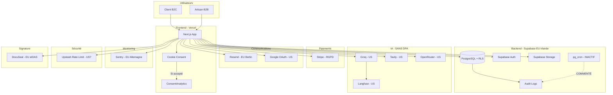
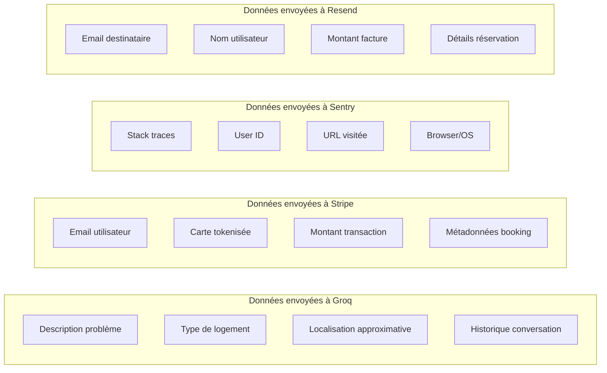
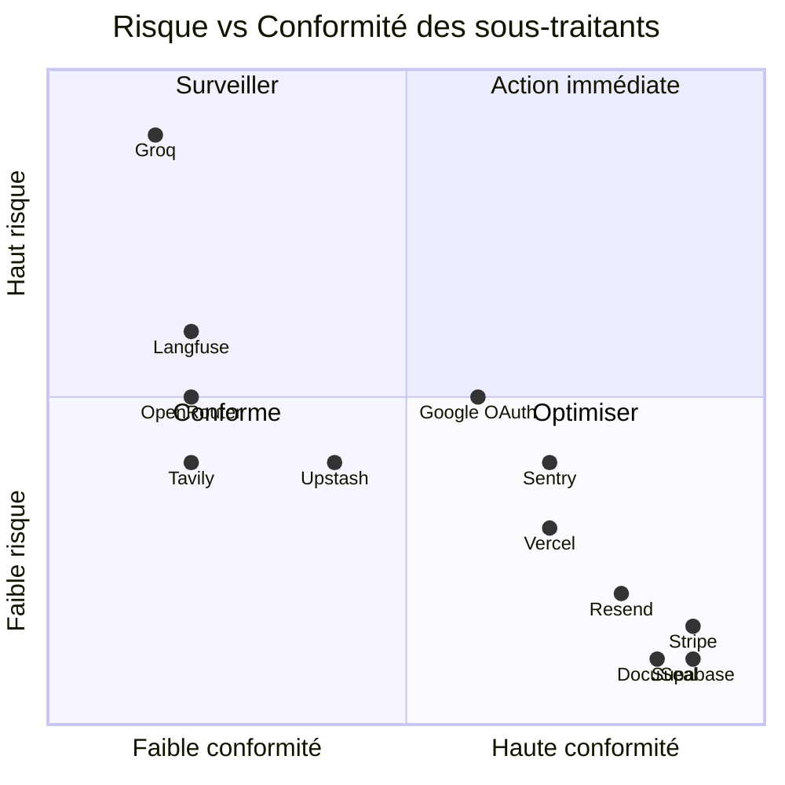
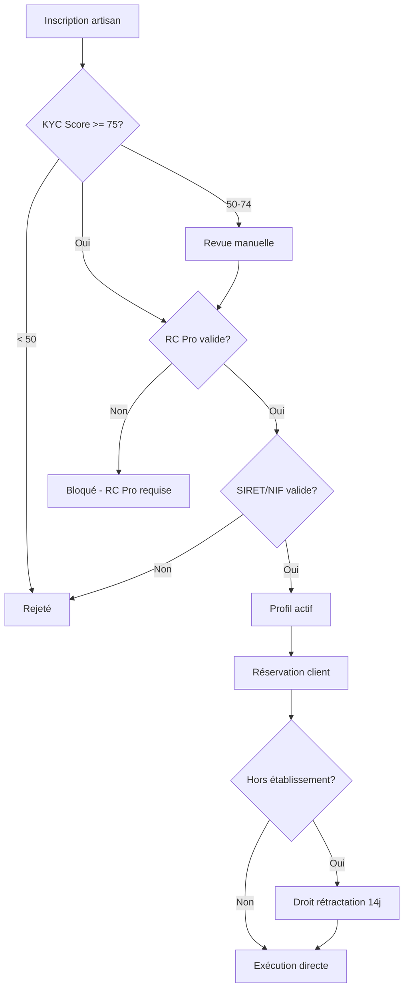

# Phase 12 — Audit Conformité & Juridique

**Projet:** VitFix Production
**Date:** 2026-04-06
**Auditeur:** Équipe technique VitFix
**Périmètre:** Application complète (Next.js, Supabase, intégrations tierces)
**Score global RGPD:** 65/100

---

## Table des matières

1. [Conformité RGPD](#1-conformité-rgpd)
2. [Conditions Générales d'Utilisation](#2-conditions-générales-dutilisation)
3. [Politique de confidentialité](#3-politique-de-confidentialité)
4. [Politique de rétention des données](#4-politique-de-rétention-des-données)
5. [Conformité sous-traitants](#5-conformité-sous-traitants)
6. [Conformité logique métier](#6-conformité-logique-métier)
7. [Accessibilité WCAG](#7-accessibilité-wcag)
8. [Conformité financière](#8-conformité-financière)
9. [Certifications sécurité](#9-certifications-sécurité)
10. [Gestion fournisseurs](#10-gestion-fournisseurs)
11. [Plan d'action priorisé](#11-plan-daction-priorisé)

---

## 1. Conformité RGPD

### Score : 65/100

Le score reflète une base solide sur les droits des personnes concernées et la sécurité
des données, mais des lacunes significatives sur la gouvernance (DPA, ROPA) et la
gestion opérationnelle (crons de rétention, notification de violations).

### 1.1 Éléments conformes

#### Politique de confidentialité

Fichier : `app/confidentialite/page.tsx`

La politique est publiée et accessible depuis le footer de l'application.
Le DPO est identifié : `dpo@vitfix.io`. Les bases légales sont documentées
pour chaque finalité de traitement. La politique couvre les droits RGPD
standard (accès, rectification, effacement, portabilité, opposition).

#### Consentement cookies granulaire

Le système de consentement implémente quatre catégories distinctes :

| Catégorie | Obligatoire | Détail |
|-----------|-------------|--------|
| Nécessaire | Oui | Session, CSRF, préférences langue |
| Performance | Non | Vercel Analytics, métriques |
| Personnalisation | Non | Thème, préférences UI |
| Publicité | Non | Aucun tracker pub actif actuellement |

Le consentement est vérifié toutes les 5 secondes via un mécanisme d'enforcement.
Le composant `ConsentAnalytics.tsx` conditionne le chargement des scripts analytics
à l'obtention du consentement performance.

#### Droit à la portabilité (Article 20)

Route : `/api/user/export-data`

L'export produit un fichier JSON complet contenant toutes les données personnelles
de l'utilisateur. Le endpoint est protégé par rate limiting (5 requêtes par minute)
pour éviter les abus. Le format JSON est conforme à l'exigence de format
structuré et lisible par machine de l'Article 20.

#### Droit à l'effacement (Article 17)

Route : `/api/user/delete-account`

La suppression couvre 26 tables de la base de données. L'utilisateur doit taper
"SUPPRIMER" pour confirmer l'action. La suppression est immédiate et irréversible.
Aucune période de grâce n'est implémentée (choix volontaire pour garantir
l'effacement rapide).

Tables concernées par la cascade de suppression :

```
profiles, bookings, invoices, quotes, payments,
notifications, messages, reviews, favorites,
artisan_services, artisan_certifications, artisan_zones,
artisan_availability, artisan_portfolio,
client_properties, client_preferences,
audit_logs, analytics_events, consent_records,
kyc_documents, kyc_verifications,
stripe_customers, stripe_subscriptions,
email_templates_sent, push_tokens, user_sessions
```

#### Registre d'audit (Article 30)

Migration : `042`

Les audit logs enregistrent les actions sensibles avec les champs suivants :
user_id, action, resource_type, resource_id, old_value, new_value, ip_address,
user_agent, created_at. La rétention cible est de 1 an.

#### Rétention analytics

Migration : `046`

Les événements analytics sont configurés avec une rétention de 90 jours.
Les données collectées sont anonymisées après cette période.

#### Row Level Security (RLS)

Migration : `041`

RLS est activé sur toutes les tables Supabase. Chaque utilisateur ne peut
accéder qu'à ses propres données. Les politiques RLS couvrent SELECT, INSERT,
UPDATE et DELETE avec des conditions basées sur `auth.uid()`.

### 1.2 Éléments non conformes

#### DPA sous-traitants manquants

**Gravité : CRITIQUE**

Quatre sous-traitants traitent des données personnelles sans Data Processing
Agreement signé :

| Sous-traitant | Données traitées | Risque |
|---------------|------------------|--------|
| Groq | Prompts IA contenant descriptions de problèmes, adresses | Élevé |
| Tavily | Requêtes de recherche web | Moyen |
| OpenRouter | Prompts IA (fallback) | Moyen |
| Langfuse | Prompts, outputs IA, user IDs | Moyen |

Sans DPA, ces transferts de données vers des entités US violent l'Article 28
du RGPD. Le cas Groq est le plus critique car les prompts peuvent contenir
des données personnelles identifiantes (adresse du logement, description
du problème, coordonnées du client).

#### Registre de traitement (ROPA) absent

**Gravité : ÉLEVÉE**

L'Article 30 du RGPD impose un registre des activités de traitement pour tout
responsable de traitement. Ce registre doit documenter :

- Les finalités de chaque traitement
- Les catégories de personnes concernées
- Les catégories de données personnelles
- Les destinataires (y compris sous-traitants)
- Les transferts hors UE
- Les délais de suppression prévus
- Les mesures de sécurité

Aucun document ROPA n'existe actuellement dans le codebase ni dans la
documentation projet.

#### Politique de rétention incomplète

**Gravité : ÉLEVÉE**

Trois catégories de données n'ont aucune politique de rétention définie :

1. **Bookings** : les réservations sont conservées indéfiniment
2. **Factures et devis** : aucune policy, alors que la loi française impose
   6 ans (Code de commerce) et la loi portugaise 10 ans
3. **Photos storage** : les images uploadées dans les buckets Supabase Storage
   n'ont aucune durée de rétention

#### Crons de nettoyage inactifs

**Gravité : ÉLEVÉE**

Les fonctions pg_cron pour le nettoyage des audit_logs (> 1 an) et des
analytics_events (> 90 jours) sont commentées dans les migrations. Les données
s'accumulent sans suppression automatique, ce qui contredit le principe de
limitation de la conservation (Article 5(1)(e)).

```sql
-- COMMENTÉ dans la migration
-- SELECT cron.schedule('cleanup_audit_logs', '0 3 * * 0',
--   $$DELETE FROM audit_logs WHERE created_at < NOW() - INTERVAL '1 year'$$);
-- SELECT cron.schedule('cleanup_analytics', '0 4 * * 0',
--   $$DELETE FROM analytics_events WHERE created_at < NOW() - INTERVAL '90 days'$$);
```

#### Liste des sous-traitants absente de la politique de confidentialité

**Gravité : MOYENNE**

La politique de confidentialité ne liste pas les sous-traitants ayant accès
aux données personnelles. L'Article 13(1)(e) impose d'informer les personnes
concernées des destinataires de leurs données.

#### Storage buckets RLS

**Gravité : MOYENNE**

La vérification RLS sur les buckets Supabase Storage n'est pas confirmée
pour tous les buckets. Les buckets de photos portfolio artisan et les
documents KYC nécessitent une vérification manuelle des politiques d'accès.

#### Re-consentement cookies absent

**Gravité : MOYENNE**

Le consentement cookies n'expire pas après 12 mois. La directive ePrivacy
et les recommandations CNIL imposent un renouvellement du consentement
au minimum tous les 13 mois. Le cookie de consentement actuel n'a pas
de date d'expiration forçant un re-consentement.

#### Procédure de notification de violation absente

**Gravité : ÉLEVÉE**

Aucune procédure documentée pour la notification de violation de données
personnelles. L'Article 33 impose une notification à l'autorité de contrôle
(CNIL pour la France, CNPD pour le Portugal) dans les 72 heures suivant
la prise de connaissance d'une violation. L'Article 34 impose une notification
aux personnes concernées si le risque est élevé.

Éléments manquants :

- Modèle de notification CNIL/CNPD
- Chaîne d'escalade interne
- Critères d'évaluation de la gravité
- Template de communication aux personnes concernées
- Registre des violations

### 1.3 Diagramme de flux des données personnelles



### 1.4 Flux des données par sous-traitant



---

## 2. Conditions Générales d'Utilisation

### 2.1 État actuel

Fichier : `app/fr/cgu/page.tsx`

Les CGU sont disponibles en deux langues (français et portugais) via le
système d'internationalisation (i18n) de l'application. Elles sont accessibles
depuis le footer et lors du processus d'inscription.

### 2.2 Contenu couvert

Les CGU traitent les sujets suivants :

| Sujet | Couvert | Détail |
|-------|---------|--------|
| Objet du service | Oui | Mise en relation client-artisan |
| Droits et obligations utilisateurs | Oui | Clients et artisans |
| Responsabilité plateforme | Oui | Limitation de responsabilité |
| Propriété intellectuelle | Oui | Contenu utilisateur et plateforme |
| Données personnelles (renvoi RGPD) | Oui | Renvoi vers politique de confidentialité |
| Loi applicable | Oui | Droit français / portugais selon localisation |
| Juridiction compétente | Oui | Tribunaux compétents identifiés |
| Modification des CGU | Oui | Notification par email |
| Résiliation | Oui | Conditions de fermeture de compte |

### 2.3 Éléments à renforcer

**Clauses IA :** Les CGU ne mentionnent pas l'utilisation de l'intelligence
artificielle pour le diagnostic, la recommandation d'artisans ou la génération
de devis automatiques. Le règlement européen sur l'IA (AI Act) entré en
application progressivement depuis 2024 impose une obligation de transparence
pour les systèmes IA interagissant avec des personnes physiques.

**Médiation consommateur :** Pour la France, l'Article L612-1 du Code de la
consommation impose de proposer un médiateur de la consommation. Cette mention
doit figurer dans les CGU et sur le site.

**Droit de rétractation :** Le mécanisme est implémenté dans le code
(conditionnel `isHorsEtablissement`) mais les CGU doivent le détailler
explicitement avec le formulaire type de rétractation (Annexe au Code de
la consommation).

### 2.4 Conformité i18n

| Langue | Fichier | Statut |
|--------|---------|--------|
| Français | `app/fr/cgu/page.tsx` | Complet |
| Portugais | `app/pt/cgu/page.tsx` | Complet |
| Anglais | Non disponible | Non requis (marchés FR/PT uniquement) |

---

## 3. Politique de confidentialité

### 3.1 État actuel

Fichier : `app/confidentialite/page.tsx`

La politique de confidentialité est publiée et couvre les éléments essentiels
imposés par les Articles 13 et 14 du RGPD.

### 3.2 Éléments présents

- Identité du responsable de traitement
- Coordonnées du DPO (`dpo@vitfix.io`)
- Finalités et bases légales de chaque traitement
- Durées de conservation (partielles)
- Droits des personnes concernées
- Droit de réclamation auprès de la CNIL/CNPD
- Cookies et technologies similaires

### 3.3 Éléments manquants

#### Liste des sous-traitants

La politique ne liste pas les sous-traitants ayant accès aux données
personnelles. Les utilisateurs n'ont aucune visibilité sur le fait que
leurs données transitent par Groq, Tavily, OpenRouter, Langfuse, Sentry,
Upstash, etc.

Proposition de format :

```
Sous-traitant : Groq Inc.
Finalité : Assistance IA pour diagnostic de problèmes
Données traitées : Description du problème, type de logement
Localisation : États-Unis
Garanties : [DPA à signer], [SCC à mettre en place]
```

#### Mécanismes de transfert international

Aucune mention des Standard Contractual Clauses (SCC) pour les transferts
vers les États-Unis. Depuis l'invalidation du Privacy Shield (Schrems II,
2020) et l'adoption du EU-US Data Privacy Framework (2023), les transferts
vers les US nécessitent soit :

1. Une certification DPF du sous-traitant US
2. Des SCC avec évaluation d'impact du transfert (TIA)
3. Des garanties supplémentaires (chiffrement, pseudonymisation)

Aucun de ces mécanismes n'est documenté pour Groq, Tavily, OpenRouter
ou Langfuse.

#### Divulgation de l'utilisation de l'IA

L'AI Act européen (Règlement 2024/1689) impose une obligation de
transparence lorsqu'un système IA interagit avec une personne physique.
La politique de confidentialité ne mentionne pas :

- Que l'assistant de diagnostic utilise des modèles de langage (LLM)
- Que les recommandations d'artisans peuvent être influencées par l'IA
- Que des données sont envoyées à des fournisseurs IA tiers (Groq)
- Le droit de l'utilisateur à demander une intervention humaine

### 3.4 Actions requises

1. Ajouter la section "Sous-traitants et destinataires des données"
2. Documenter les mécanismes de transfert international (SCC/DPF)
3. Ajouter une section "Intelligence artificielle et traitement automatisé"
4. Mettre à jour les durées de conservation manquantes
5. Ajouter le formulaire de contact DPO en plus de l'email

---

## 4. Politique de rétention des données

### 4.1 Tableau de rétention

| Catégorie | Rétention cible | Implémenté | Base légale | Fichier/Migration |
|-----------|-----------------|------------|-------------|-------------------|
| Audit logs | 1 an | Cron commenté | Art. 30 RGPD | Migration 042 |
| Analytics events | 90 jours | Cron commenté | Consentement | Migration 046 |
| Bookings | Non défini | Non | Exécution contrat | - |
| Factures | 6 ans (FR) / 10 ans (PT) | Non | Obligation légale | - |
| Devis | 6 ans (FR) / 10 ans (PT) | Non | Obligation légale | - |
| Données Stripe | 7 ans (fiscal) | Oui | Géré par Stripe | - |
| Photos storage | Non défini | Non | Consentement | - |
| Comptes supprimés | Immédiat | Oui | Art. 17 RGPD | `/api/user/delete-account` |
| Documents KYC | Non défini | Non | Obligation légale | - |
| Conversations IA | Non défini | Non | Consentement | - |
| Tokens OAuth chiffrés | Durée du compte | Oui | Exécution contrat | - |
| Logs Sentry | 90 jours | Oui | Géré par Sentry | - |
| Consent records | Durée du compte + 3 ans | Non vérifié | Preuve consentement | - |

### 4.2 Obligations légales par juridiction

#### France

- **Code de commerce (Art. L123-22)** : conservation des documents comptables
  pendant 10 ans. Les factures et devis doivent être conservés au minimum 6 ans
  à compter de la dernière opération.
- **Code général des impôts** : conservation 6 ans pour les pièces justificatives
  fiscales.
- **RGPD** : principe de minimisation, les données ne doivent pas être conservées
  au-delà de la finalité initiale.

#### Portugal

- **Código Comercial (Art. 40)** : conservation des documents commerciaux
  pendant 10 ans.
- **Legislação fiscal** : conservation des factures pendant 10 ans minimum
  pour conformité SAF-T.
- **RGPD** : mêmes principes que la France (règlement européen uniforme).

### 4.3 Crons de nettoyage

Les deux crons pg_cron identifiés sont actuellement commentés :

**audit_logs cleanup :**
- Fréquence prévue : hebdomadaire (dimanche 3h)
- Seuil : suppression des entrées > 1 an
- Statut : INACTIF

**analytics_events cleanup :**
- Fréquence prévue : hebdomadaire (dimanche 4h)
- Seuil : suppression des entrées > 90 jours
- Statut : INACTIF

### 4.4 Recommandations

1. Activer les crons pg_cron existants en décommentant les lignes
2. Créer un cron pour les photos storage orphelines (non liées à un booking actif)
3. Définir une politique de rétention pour les bookings (suggestion : 3 ans après
   la dernière interaction, puis anonymisation)
4. Implémenter une archivage des factures/devis avant suppression (obligation légale)
5. Ajouter un cron de nettoyage des conversations IA (suggestion : 6 mois)
6. Documenter toutes les durées dans un fichier `RETENTION_POLICY.md`

---

## 5. Conformité sous-traitants

### 5.1 Inventaire complet

| Service | Usage | Données traitées | Hébergement | RGPD | DPA | Risque |
|---------|-------|------------------|-------------|------|-----|--------|
| Supabase | DB, auth, storage | Toutes données utilisateur | EU (Irlande) | Conforme | Auto (ToS) | Faible |
| Sentry | Monitoring erreurs | Stack traces, user IDs, URLs | EU (Allemagne) | Conforme | Disponible | Moyen |
| Stripe | Paiements | Email, cartes tokenisées, montants | Multi-région | Conforme | Standard | Faible |
| Resend | Emails transactionnels | Emails, noms, montants factures | EU (Berlin) | Conforme | Disponible | Faible |
| Vercel | Hosting, CDN | Métriques pages, IP visiteurs | US + Edge EU | Partiel | Disponible | Faible |
| Upstash | Rate limiting | Adresses IP, compteurs | US (probable) | Non vérifié | Non vérifié | Moyen |
| Google OAuth | Authentification agent email | Tokens Gmail chiffrés | US | Partiel | DPA Google Workspace | Moyen |
| Groq | IA agents diagnostic | Prompts, descriptions problèmes | US | Non conforme | Aucun | **Élevé** |
| Tavily | Recherche web agents | Requêtes de recherche | US | Non conforme | Aucun | Moyen |
| OpenRouter | IA fallback | Prompts, contexte conversation | US | Non conforme | Aucun | Moyen |
| Langfuse | Monitoring IA | Prompts, outputs, user IDs | US (probable) | Non conforme | Aucun | Moyen |
| DocuSeal | Signature électronique | Contrats, emails, identité | EU (eIDAS) | Conforme | Disponible | Faible |

### 5.2 Analyse détaillée des risques élevés

#### Groq (Risque ÉLEVÉ)

Groq est le fournisseur IA principal pour les agents de diagnostic. Les données
envoyées incluent potentiellement :

- Descriptions de problèmes de logement (peuvent contenir des adresses)
- Type et caractéristiques du logement
- Historique de conversation
- Contexte métier (type d'artisan recherché)

**Problèmes identifiés :**
- Aucun DPA signé
- Hébergement US sans SCC documentées
- Politique de rétention des prompts par Groq non vérifiée
- Pas de consentement explicite de l'utilisateur pour le traitement IA
- Pas de filtre PII sur les prompts envoyés

**Actions requises :**
1. Contacter Groq pour signer un DPA
2. Vérifier la certification Data Privacy Framework de Groq
3. Implémenter un filtre PII côté client avant envoi des prompts
4. Ajouter un consentement explicite pour le traitement IA
5. Alternative : évaluer Mistral AI (hébergé EU) comme remplacement

#### Langfuse (Risque MOYEN-ÉLEVÉ)

Langfuse reçoit les prompts et outputs de tous les appels IA pour le
monitoring. Les user IDs sont transmis, permettant de relier les traces
IA aux utilisateurs individuels.

**Actions requises :**
1. Vérifier la région d'hébergement exacte
2. Pseudonymiser les user IDs avant envoi
3. Signer un DPA ou migrer vers une instance self-hosted EU

#### Upstash (Risque MOYEN)

Upstash stocke les adresses IP et compteurs de rate limiting. La région
d'hébergement n'est pas confirmée.

**Actions requises :**
1. Vérifier la région dans le dashboard Upstash
2. Si US : migrer vers la région EU (Frankfurt disponible)
3. Signer le DPA disponible sur le site Upstash

### 5.3 Matrice de conformité



---

## 6. Conformité logique métier

### 6.1 KYC (Know Your Customer)

Fichier : `lib/kyc-verification.ts`

Le système KYC implémente un scoring de 0 à 100 pour la vérification
des artisans. Les contrôles effectués :

| Contrôle | Méthode | Score |
|----------|---------|-------|
| Validation SIRET (France) | Algorithme de Luhn | 0-25 |
| Validation NIF (Portugal) | Modulo 11 | 0-25 |
| Vérification identité | OCR document | 0-25 |
| Vérification RC Pro | Upload attestation | 0-25 |

**Seuils :**
- Score >= 75 : vérification automatique approuvée
- Score 50-74 : revue manuelle requise
- Score < 50 : rejeté automatiquement

### 6.2 AML / Screening sanctions

**Statut : NON IMPLÉMENTÉ**

Aucun screening contre les listes de sanctions n'est en place :

- OFAC (Office of Foreign Assets Control, US)
- Listes de sanctions UN
- Listes de sanctions EU
- Listes nationales France (gel des avoirs)
- Listes nationales Portugal

Pour une plateforme de mise en relation avec transactions financières,
le screening AML n'est pas légalement obligatoire à ce stade (VitFix
n'est pas un établissement financier). Toutefois, le risque augmente
avec le volume de transactions. À envisager si le volume dépasse
100,000 EUR/mois de transactions.

### 6.3 Vérification d'âge

**Statut : NON IMPLÉMENTÉ**

Aucune vérification d'âge n'est effectuée lors de l'inscription.
L'Article 8 du RGPD fixe l'âge du consentement numérique à 16 ans
(15 ans en France, 13 ans au Portugal). Une case à cocher confirmant
la majorité (ou l'âge minimum) devrait être ajoutée au formulaire
d'inscription.

### 6.4 RC Pro (Responsabilité Civile Professionnelle)

**Statut : IMPLÉMENTÉ**

La vérification de la RC Pro est un hard block dans le processus
d'inscription artisan. Référence légale : Article L243-2 du Code des
assurances (France). La génération de PDF (devis/factures) inclut
les mentions obligatoires RC Pro.

Contrôles implémentés :
- Upload obligatoire de l'attestation RC Pro
- Vérification de la date de validité
- Blocage de la publication du profil si RC Pro expirée
- Rappel automatique 30 jours avant expiration

### 6.5 Droit de rétractation B2C

**Statut : IMPLÉMENTÉ (conditionnel)**

Le droit de rétractation de 14 jours est implémenté avec la condition
`isHorsEtablissement`. Conformément à l'Article L221-18 du Code de la
consommation, le droit de rétractation s'applique aux contrats conclus
hors établissement.

Exceptions correctement implémentées :
- Services pleinement exécutés avant la fin du délai (avec accord)
- Travaux d'urgence à la demande expresse du consommateur

### 6.6 Flux de conformité métier



---

## 7. Accessibilité WCAG

### 7.1 Tests automatisés en place

L'application dispose de tests E2E couvrant les aspects d'accessibilité suivants :

| Test | Outil | Seuil | Statut |
|------|-------|-------|--------|
| Landmarks ARIA | E2E (Playwright) | Présence requise | Actif |
| Skip-to-content | E2E (Playwright) | Lien présent | Actif |
| Attributs alt images | E2E (Playwright) | 100% couverture | Actif |
| Labels formulaires | E2E (Playwright) | Tous les inputs | Actif |
| Navigation clavier (tab) | E2E (Playwright) | Ordre logique | Actif |
| Hiérarchie headings | E2E (Playwright) | h1 > h2 > h3 séquentiel | Actif |
| Score Lighthouse a11y | Lighthouse CI | >= 90/100 | Actif |
| Violations axe-core | tests.yml (CI) | 0 critique/sérieuse | Actif |

### 7.2 Configuration axe-core

Le pipeline CI (`tests.yml`) exécute axe-core et bloque le déploiement
sur les violations de sévérité "critical" et "serious". Les violations
"moderate" et "minor" sont reportées mais ne bloquent pas.

### 7.3 Éléments manquants

#### Audit WCAG 2.1 AA complet

Aucun audit manuel par un expert accessibilité n'a été réalisé. Les tests
automatisés couvrent environ 30-40% des critères WCAG 2.1 AA. Les aspects
suivants ne sont pas testés automatiquement :

- Compréhensibilité du contenu (critère 3.1)
- Navigation cohérente entre les pages (critère 3.2)
- Aide à la saisie et prévention des erreurs (critère 3.3)
- Compatibilité avec les technologies d'assistance (critère 4.1)
- Alternatives pour les contenus temporels (si applicable)

#### Test de contraste automatisé

Pas de vérification automatisée des ratios de contraste couleurs.
Le critère WCAG 1.4.3 (contraste minimum 4.5:1 pour le texte normal,
3:1 pour le texte large) n'est pas testé systématiquement.

Recommandation : ajouter `@axe-core/cli` avec la règle `color-contrast`
activée en mode bloquant dans le pipeline CI.

#### Déclaration d'accessibilité

Pas de page de déclaration d'accessibilité publiée. La directive européenne
2016/2102 relative à l'accessibilité des sites web impose une déclaration
d'accessibilité pour les organismes du secteur public. Pour le secteur
privé, c'est une bonne pratique recommandée, surtout en France où le
RGAA (Référentiel Général d'Amélioration de l'Accessibilité) s'applique
progressivement.

### 7.4 Conformité RGAA (France)

Le RGAA impose aux entreprises réalisant un chiffre d'affaires supérieur
à 250 millions d'euros de se conformer au référentiel. VitFix n'est pas
actuellement soumis à cette obligation, mais l'European Accessibility Act
(directive 2019/882) étendra les obligations d'accessibilité aux services
numériques privés à partir de juin 2025.

---

## 8. Conformité financière

### 8.1 TVA France

#### Seuils Article 293B CGI

Le système implémente le suivi des seuils de franchise en base de TVA :

| Seuil | Montant | Implémenté |
|-------|---------|------------|
| Franchise standard (services) | 37,500 EUR | Oui |
| Franchise majorée (services) | 41,250 EUR | Oui |
| Franchise standard (ventes) | 91,900 EUR | Oui |
| Franchise majorée (ventes) | 101,000 EUR | Oui |

Le dashboard artisan affiche le statut TVA et alerte à l'approche des seuils.
Le calcul est basé sur le chiffre d'affaires de l'année civile en cours.

### 8.2 TVA Portugal

#### Seuils Article 53.º CIVA

| Seuil | Montant | Implémenté |
|-------|---------|------------|
| Isenção standard | 14,500 EUR | Oui |

Variantes régionales implémentées :

| Région | Taux normal | Taux intermédiaire | Taux réduit |
|--------|-------------|-------------------|-------------|
| Continente | 23% | 13% | 6% |
| Açores | 16% | 9% | 4% |
| Madeira | 22% | 12% | 5% |

### 8.3 Factur-X (France)

La génération de factures respecte la norme EN 16931 :

| Exigence | Statut | Détail |
|----------|--------|--------|
| Format PDF/A-3 | Implémenté | Conformité archivage long terme |
| XML embarqué | Implémenté | Profil MINIMUM ou BASIC |
| Mentions obligatoires | Implémenté | N° SIRET, TVA, RC Pro |
| Numérotation séquentielle | Implémenté | Préfixe année + séquence |
| Horodatage | Implémenté | UTC avec timezone |

### 8.4 SAF-T PT (Portugal)

Conformité avec la Portaria n.º 363/2010 :

| Exigence | Statut | Détail |
|----------|--------|--------|
| ATCUD (code unique document) | Implémenté | Série + séquence + validation |
| QR Code fiscal | Implémenté | Conforme spécification AT |
| Hash chain RSA | Implémenté | Signature chaînée des documents |
| Export XML SAF-T | Implémenté | Structure conforme Portaria |
| NIF validation (modulo 11) | Implémenté | `lib/validators/nif.ts` |

### 8.5 Validation des identifiants fiscaux

| Identifiant | Pays | Algorithme | Fichier |
|-------------|------|------------|---------|
| SIRET | France | Luhn (14 chiffres) | `lib/validators/siret.ts` |
| NIF | Portugal | Modulo 11 (9 chiffres) | `lib/validators/nif.ts` |
| TVA intra. | EU | Préfixe pays + validation | `lib/validators/vat.ts` |

### 8.6 Stripe

| Élément | Statut | Détail |
|---------|--------|--------|
| Plans configurés | Oui | Abonnements artisans |
| Tax IDs clients | Non | Pas de collecte SIRET/NIF client |
| Billing address | Non | Pas de validation adresse de facturation |
| Stripe Tax | Non | TVA gérée manuellement |
| Receipts | Oui | Emails de confirmation Stripe |

**Recommandation :** Activer Stripe Tax pour automatiser le calcul et la
collecte de TVA, en particulier pour les transactions cross-border FR/PT.
Ajouter la collecte des tax_ids pour les clients professionnels.

---

## 9. Certifications sécurité

### 9.1 État actuel

| Certification | Statut | Pertinence |
|---------------|--------|------------|
| ISO 27001 | Non | Standard SMSI |
| SOC 2 Type I | Non | Audit contrôles sécurité |
| SOC 2 Type II | Non | Audit contrôles sur 6-12 mois |
| PCI DSS | Non requis | Stripe gère la conformité PCI |
| HDS (Hébergement Données Santé) | Non applicable | Pas de données de santé |

### 9.2 Analyse de nécessité

Pour le stade actuel de VitFix (startup B2C/B2B, marché FR/PT), aucune
certification sécurité n'est légalement requise :

- **PCI DSS** : non requis car Stripe gère la tokenisation des cartes.
  VitFix ne stocke, ne traite et ne transmet aucun numéro de carte.
- **ISO 27001** : non requis mais deviendrait un avantage commercial
  si VitFix cible des grands comptes (syndics de copropriété, bailleurs
  sociaux).
- **SOC 2** : pertinent uniquement si des clients enterprise demandent
  des preuves de contrôles sécurité formalisés.

### 9.3 Mesures de sécurité existantes (non certifiées)

Bien qu'aucune certification ne soit en place, les mesures suivantes
sont implémentées :

| Mesure | Détail |
|--------|--------|
| RLS Supabase | Isolation des données par utilisateur |
| Rate limiting (Upstash) | Protection contre les abus |
| CSRF protection | Tokens Next.js natifs |
| Auth Supabase | JWT, refresh tokens, MFA disponible |
| Chiffrement tokens OAuth | Tokens Gmail chiffrés en DB |
| Sanitization inputs | Validation Zod côté serveur |
| CSP headers | Content Security Policy configurée |
| HTTPS forcé | Via Vercel |
| Audit logs | Traçabilité des actions sensibles |

### 9.4 Roadmap certifications

| Horizon | Action | Déclencheur |
|---------|--------|-------------|
| Court terme (6 mois) | Aucune certification | Pas de demande client |
| Moyen terme (1 an) | Évaluer SOC 2 Type I | Si clients syndics grands comptes |
| Long terme (2 ans) | ISO 27001 | Si expansion européenne hors FR/PT |

---

## 10. Gestion fournisseurs

### 10.1 État actuel

La gestion des fournisseurs présente trois lacunes principales :

1. **Pas de contrats formels revus** : les relations avec les sous-traitants
   reposent uniquement sur les Terms of Service en ligne. Aucune négociation
   contractuelle n'a eu lieu.

2. **Pas de stratégie de sortie documentée** : en cas de défaillance ou de
   changement de politique d'un fournisseur, aucun plan de migration n'existe.

3. **Pas de clauses de terminaison documentées** : les conditions de résiliation
   et de récupération des données ne sont pas analysées pour chaque fournisseur.

### 10.2 Évaluation des risques de dépendance

| Fournisseur | Criticité | Alternatives | Temps migration estimé |
|-------------|-----------|-------------|----------------------|
| Supabase | Critique | PostgreSQL auto-hébergé, PlanetScale | 2-4 semaines |
| Stripe | Critique | Adyen, Mollie | 3-6 semaines |
| Vercel | Haute | Cloudflare Pages, Netlify | 1-2 semaines |
| Groq | Moyenne | Mistral AI, OpenAI, Anthropic | 1-3 jours |
| Resend | Moyenne | SendGrid, Postmark, AWS SES | 2-5 jours |
| Sentry | Faible | GlitchTip (self-hosted), Datadog | 1-2 jours |
| Upstash | Faible | Redis auto-hébergé | 1-2 jours |
| DocuSeal | Faible | YouSign, DocuSign | 1-2 semaines |
| Langfuse | Faible | Self-hosted Langfuse, custom logging | 1-2 jours |

### 10.3 Stratégie de sortie recommandée

Pour chaque fournisseur critique, documenter :

1. **Procédure d'export des données** : format, fréquence des backups,
   délai d'export après résiliation
2. **Mapping des fonctionnalités** : correspondance entre les features
   utilisées et les alternatives disponibles
3. **Budget de migration** : estimation des coûts humains et techniques
4. **Délai de préavis** : vérifier les clauses de préavis dans les ToS
5. **Données à récupérer** : inventaire des données stockées chez le
   fournisseur

### 10.4 Clause contractuelle type recommandée

Pour tout nouveau fournisseur, exiger contractuellement :

- Droit d'export des données dans un format standard (JSON, CSV, SQL dump)
- Engagement de suppression des données après résiliation (délai max 30 jours)
- Notification en cas de changement de sous-traitant ou de localisation
- SLA minimum (uptime 99.9%, temps de réponse support < 24h)
- DPA conforme RGPD signé avant toute mise en production

---

## 11. Plan d'action priorisé

### 11.1 CRITIQUE (Semaine 1-2)

Ces actions doivent être traitées avant tout nouveau déploiement
en production.

#### 11.1.1 DPA Groq ou consentement explicite IA

**Responsable :** DPO + Tech Lead
**Effort :** 2-3 jours

Option A (préférée) :
- Contacter Groq pour obtenir un DPA
- Vérifier la certification Data Privacy Framework
- Si DPF certifié : documenter la base de transfert
- Si non certifié : mettre en place des SCC

Option B (temporaire) :
- Ajouter un consentement explicite avant chaque utilisation de l'IA
- Informer l'utilisateur que ses données seront traitées aux US
- Permettre le refus avec fallback sans IA

Option C (migration) :
- Remplacer Groq par Mistral AI (hébergé EU, Paris)
- Effort supplémentaire : 3-5 jours pour migration et tests

#### 11.1.2 Activer pg_cron pour cleanup

**Responsable :** Backend dev
**Effort :** 0.5 jour

Décommenter les crons dans les migrations 042 et 046. Vérifier que
pg_cron est activé sur l'instance Supabase. Tester en staging.

```sql
SELECT cron.schedule('cleanup_audit_logs', '0 3 * * 0',
  $$DELETE FROM audit_logs WHERE created_at < NOW() - INTERVAL '1 year'$$);

SELECT cron.schedule('cleanup_analytics', '0 4 * * 0',
  $$DELETE FROM analytics_events WHERE created_at < NOW() - INTERVAL '90 days'$$);
```

#### 11.1.3 Mettre à jour la politique de confidentialité

**Responsable :** DPO + Juridique
**Effort :** 1-2 jours

Sections à ajouter :
1. Liste complète des sous-traitants avec localisation et finalité
2. Mécanismes de transfert international (SCC/DPF)
3. Section "Intelligence artificielle" (transparence AI Act)
4. Durées de conservation complètes

#### 11.1.4 Filtre PII Sentry

**Responsable :** Frontend dev
**Effort :** 0.5 jour

Ajouter un callback `beforeSend` dans la configuration Sentry pour
expurger les données personnelles des rapports d'erreur :

```typescript
Sentry.init({
  beforeSend(event) {
    // Expurger emails
    if (event.user?.email) {
      event.user.email = '[REDACTED]';
    }
    // Expurger téléphones dans les breadcrumbs
    if (event.breadcrumbs) {
      event.breadcrumbs = event.breadcrumbs.map(b => ({
        ...b,
        message: b.message?.replace(
          /(\+?\d{1,3}[-.\s]?\(?\d{1,4}\)?[-.\s]?\d{1,4}[-.\s]?\d{1,9})/g,
          '[PHONE_REDACTED]'
        )
      }));
    }
    return event;
  }
});
```

### 11.2 ÉLEVÉ (Sprint suivant, semaines 3-4)

#### 11.2.1 Documenter le registre de traitement (ROPA)

**Responsable :** DPO
**Effort :** 2-3 jours

Créer un registre conforme à l'Article 30 couvrant :
- Chaque finalité de traitement
- Les catégories de données et de personnes concernées
- Les destinataires
- Les transferts hors UE
- Les mesures de sécurité

#### 11.2.2 Vérifier et migrer Upstash EU

**Responsable :** Backend dev
**Effort :** 0.5-1 jour

1. Vérifier la région actuelle dans le dashboard Upstash
2. Si US : recréer la base Redis en région EU (Frankfurt)
3. Mettre à jour les variables d'environnement

#### 11.2.3 Politique de rétention complète

**Responsable :** DPO + Backend dev
**Effort :** 2-3 jours

Définir et implémenter la rétention pour :
- Bookings : 3 ans après dernière interaction, puis anonymisation
- Factures/devis : archivage 6 ans (FR) / 10 ans (PT), puis suppression
- Photos storage : suppression si booking clôturé > 1 an
- Conversations IA : suppression après 6 mois
- Documents KYC : durée du compte + 1 an post-suppression

#### 11.2.4 Re-consentement cookies 12 mois

**Responsable :** Frontend dev
**Effort :** 0.5 jour

Ajouter un champ `consentDate` dans le cookie de consentement.
Si la date dépasse 12 mois, forcer un nouveau recueil de consentement.

```typescript
const CONSENT_MAX_AGE_MS = 12 * 30 * 24 * 60 * 60 * 1000; // ~12 mois

function isConsentExpired(consentDate: string): boolean {
  return Date.now() - new Date(consentDate).getTime() > CONSENT_MAX_AGE_MS;
}
```

#### 11.2.5 Procédure notification violation données

**Responsable :** DPO + Direction
**Effort :** 1-2 jours

Documenter :
1. Chaîne d'escalade interne (détection, évaluation, décision)
2. Critères d'évaluation de la gravité (matrice risque)
3. Template de notification CNIL (formulaire en ligne teleservice.cnil.fr)
4. Template de notification CNPD (Portugal)
5. Template de communication aux personnes concernées
6. Registre des violations (même si aucune à ce jour)
7. Délai : 72 heures maximum après prise de connaissance (Art. 33)

### 11.3 MOYEN (Trimestre, semaines 5-12)

#### 11.3.1 Screening AML/sanctions

**Responsable :** Backend dev + Juridique
**Effort :** 5-8 jours

Options :
- API ComplyAdvantage (payant, complet)
- API OpenSanctions (open source, listes EU/UN/OFAC)
- Implémentation custom avec téléchargement des listes publiques

Périmètre initial : vérification à l'inscription artisan uniquement.
Fréquence : re-vérification mensuelle.

#### 11.3.2 Vérification d'âge inscription

**Responsable :** Frontend dev
**Effort :** 0.5 jour

Ajouter une case à cocher obligatoire lors de l'inscription :
"Je certifie avoir au moins 18 ans" (ou 15 ans pour la France,
13 ans pour le Portugal selon le contexte).

Pour les artisans : l'âge minimum est 18 ans (capacité contractuelle).
Pour les clients : l'âge minimum est 15 ans (France) / 13 ans (Portugal).

#### 11.3.3 Audit WCAG 2.1 AA complet

**Responsable :** UX + Externe
**Effort :** 5-10 jours (audit externe)

1. Sélectionner un prestataire certifié RGAA/WCAG
2. Définir l'échantillon de pages (10-15 pages représentatives)
3. Inclure les parcours critiques (inscription, réservation, paiement)
4. Tester avec lecteurs d'écran (NVDA, VoiceOver)
5. Tester contraste couleurs sur toute la palette
6. Produire un rapport de conformité avec plan de remédiation

#### 11.3.4 Stratégie de sortie fournisseurs

**Responsable :** Tech Lead + Direction
**Effort :** 2-3 jours

Pour chaque fournisseur critique (Supabase, Stripe, Vercel) :
1. Documenter la procédure d'export des données
2. Identifier les alternatives viables
3. Estimer le coût et le délai de migration
4. Tester l'export des données (backup restore test)
5. Archiver le plan dans `docs/exit-strategies/`

#### 11.3.5 Évaluation SOC 2

**Responsable :** Direction + RSSI (si nommé)
**Effort :** Évaluation initiale 1-2 jours

Évaluer la pertinence de SOC 2 Type I en fonction de :
- Nombre de clients enterprise (syndics grands comptes)
- Volume de données traitées
- Exigences contractuelles des prospects
- Budget disponible (SOC 2 Type I : 15,000-50,000 EUR)

### 11.4 Calendrier récapitulatif

```mermaid
gantt
    title Plan d'action conformité VitFix
    dateFormat YYYY-MM-DD
    axisFormat %d/%m

    section Critique
    DPA Groq / consentement IA          :crit, c1, 2026-04-07, 3d
    Activer pg_cron cleanup              :crit, c2, 2026-04-07, 1d
    MAJ politique confidentialité        :crit, c3, 2026-04-08, 2d
    Filtre PII Sentry                    :crit, c4, 2026-04-08, 1d

    section Élevé
    ROPA (registre traitement)           :high, h1, 2026-04-21, 3d
    Vérifier/migrer Upstash EU           :high, h2, 2026-04-21, 1d
    Politique rétention complète         :high, h3, 2026-04-22, 3d
    Re-consentement cookies 12 mois      :high, h4, 2026-04-24, 1d
    Procédure notification violation     :high, h5, 2026-04-25, 2d

    section Moyen
    Screening AML/sanctions              :med, m1, 2026-05-04, 8d
    Vérification âge inscription         :med, m2, 2026-05-04, 1d
    Audit WCAG 2.1 AA complet           :med, m3, 2026-05-11, 10d
    Stratégie sortie fournisseurs        :med, m4, 2026-05-25, 3d
    Évaluation SOC 2                     :med, m5, 2026-06-01, 2d
```

---

## Annexes

### A. Références légales

| Référence | Sujet | Juridiction |
|-----------|-------|-------------|
| Règlement (UE) 2016/679 | RGPD | UE |
| Règlement (UE) 2024/1689 | AI Act | UE |
| Directive 2002/58/CE | ePrivacy | UE |
| Directive 2019/882 | Accessibilité | UE |
| Loi n° 78-17 (Informatique et Libertés) | Protection données | France |
| Art. L221-18 Code de la consommation | Rétractation | France |
| Art. 293B CGI | Franchise TVA | France |
| Art. L243-2 Code des assurances | RC Pro | France |
| Art. L612-1 Code de la consommation | Médiation | France |
| EN 16931 | Factur-X | UE |
| Lei n.º 58/2019 | Protection données | Portugal |
| Art. 53.º CIVA | Isenção IVA | Portugal |
| Portaria n.º 363/2010 | SAF-T PT | Portugal |
| RGAA 4.1 | Accessibilité web | France |

### B. Contacts autorités de contrôle

| Autorité | Pays | Site | Notification violation |
|----------|------|------|----------------------|
| CNIL | France | cnil.fr | teleservice.cnil.fr |
| CNPD | Portugal | cnpd.pt | cnpd.pt/notificacoes |

### C. Glossaire

| Terme | Définition |
|-------|------------|
| DPA | Data Processing Agreement, contrat entre responsable et sous-traitant |
| DPF | Data Privacy Framework, cadre de transfert UE-US |
| DPO | Data Protection Officer, délégué à la protection des données |
| PII | Personally Identifiable Information, donnée personnelle identifiante |
| RLS | Row Level Security, sécurité au niveau des lignes PostgreSQL |
| ROPA | Record of Processing Activities, registre des traitements |
| SCC | Standard Contractual Clauses, clauses contractuelles types |
| TIA | Transfer Impact Assessment, évaluation d'impact du transfert |

### D. Historique des révisions

| Date | Version | Auteur | Changement |
|------|---------|--------|------------|
| 2026-04-06 | 1.0 | Équipe VitFix | Audit initial Phase 12 |

---

*Prochain audit prévu : 2026-07-06 (T+3 mois) ou après implémentation des actions critiques.*
