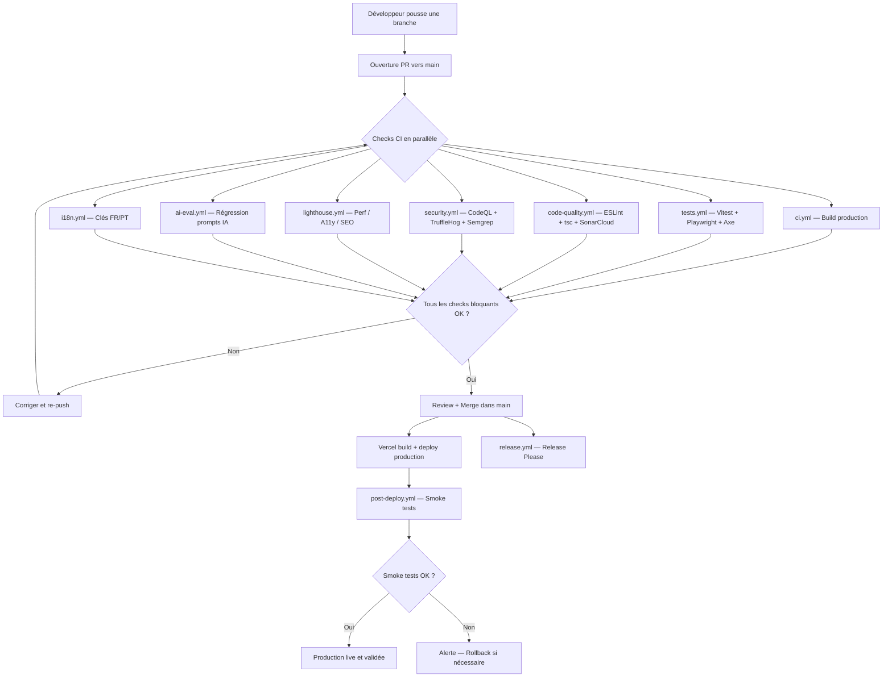

# Playbook de Déploiement — Vitfix.io

> Référence opérationnelle pour déployer, surveiller et dépanner la production.
> Lire aussi : `ENVIRONMENTS.md`, `incident-runbook.md`, `BACKUP-STRATEGY.md`.

---

## 1. Vue d'ensemble du déploiement

Vitfix tourne sur **Vercel** avec auto-deploy depuis la branche `main`.

| Environnement | URL | Branche | Déclencheur |
|---------------|-----|---------|-------------|
| Production | `fixit-production.vercel.app` / `vitfix.io` | `main` | Merge sur main |
| Preview | `*.vercel.app` (URL unique par deploy) | Branches PR | Ouverture/update de PR |
| Local | `localhost:3000` | Toute branche | `npm run dev` |

Le flux standard : ouvrir une PR, attendre que les checks CI passent, merger dans `main`. Vercel détecte le push, build le projet, déploie automatiquement en production. Un workflow GitHub Actions (`post-deploy.yml`) lance ensuite des smoke tests sur la production.

Aucune intervention manuelle n'est requise pour un déploiement standard.

---

## 2. Pipeline CI/CD

### Diagramme du flux



### Checks bloquants (doivent passer avant merge)

| Workflow | Fichier | Ce qu'il vérifie |
|----------|---------|------------------|
| Build production | `ci.yml` | `npm run build` compile sans erreur |
| Tests | `tests.yml` | Vitest (10+ tests) + Playwright E2E (7 specs, 3 navigateurs) + Axe WCAG |
| Qualité | `code-quality.yml` | ESLint + `tsc --noEmit` + SonarCloud |
| Sécurité | `security.yml` | CodeQL, TruffleHog (secrets), Semgrep (OWASP+JWT), Giskard (prompts) |
| Lighthouse | `lighthouse.yml` | Seuils : perf 80, a11y 90, SEO 90, best practices 85 |
| IA eval | `ai-eval.yml` | DeepEval sur fichiers IA modifiés uniquement |

### Checks non-bloquants

| Workflow | Fichier | Comportement |
|----------|---------|--------------|
| i18n | `i18n.yml` | Warning si clés FR/PT désynchronisées |
| Release | `release.yml` | Crée/met à jour la PR de release (changelog auto) |
| Langfuse eval | `langfuse-eval.yml` | Nocturne (2h UTC), crée une issue si qualité < 0.7 |

---

## 3. Checklist pré-déploiement

Avant de merger une PR dans `main`, vérifier :

### Automatique (via CI)

- [ ] Build production OK (`ci.yml` vert)
- [ ] Tests unitaires et E2E passent (`tests.yml` vert)
- [ ] Lint + TypeScript + SonarCloud OK (`code-quality.yml` vert)
- [ ] Aucun secret exposé (`security.yml` vert)
- [ ] Lighthouse au-dessus des seuils (`lighthouse.yml` vert)
- [ ] Si fichiers IA modifiés : régression prompts OK (`ai-eval.yml` vert)

### Manuel (selon le contexte)

- [ ] Variables d'environnement ajoutées dans Vercel (si nouvelle variable requise)
- [ ] Migration Supabase testée en local ou preview (si modif DB)
- [ ] Backup DB fait avant migration destructive (`pg_dump`)
- [ ] PR reviewée par au moins un pair
- [ ] Preview Vercel testée manuellement pour les changements visuels
- [ ] Changelog des commits lisible (préfixes conventionnels : `feat:`, `fix:`, `ai:`, `voice:`, `perf:`)

---

## 4. Processus de déploiement

### Déploiement standard (le plus courant)

1. **Merger la PR** dans `main` via GitHub (bouton "Merge pull request")
2. **Vercel détecte le push** et lance le build automatiquement (~2-3 min)
3. **Le workflow CI** (`ci.yml`) tourne en parallèle sur GitHub Actions
4. **Après succès du CI**, `post-deploy.yml` se déclenche automatiquement
5. **Smoke tests** vérifient :
   - `/api/health` retourne HTTP 200
   - Page d'accueil FR (`/fr/`) retourne HTTP 200
   - Page d'accueil PT (`/pt/`) retourne HTTP 200
6. **Si les smoke tests échouent**, une alerte est émise dans les logs GitHub Actions

### Vérification manuelle post-deploy

```bash
# Health check
curl -s https://fixit-production.vercel.app/api/health | jq .

# Pages principales
curl -s -o /dev/null -w "%{http_code}" https://fixit-production.vercel.app/fr/
curl -s -o /dev/null -w "%{http_code}" https://fixit-production.vercel.app/pt/
```

### Déploiement via CLI (rare, en cas de besoin)

```bash
# Installer Vercel CLI
npm i -g vercel

# Deploy en production (depuis la branche main)
vercel --prod --yes

# Deploy preview (test sans affecter la prod)
vercel
```

---

## 5. Migrations base de données

Supabase utilise des fichiers SQL séquentiels dans `supabase/migrations/`.

### Ajouter une migration

```bash
# Créer un nouveau fichier de migration
# Format : supabase/migrations/NNN_description.sql
# Exemple : supabase/migrations/042_add_column_x.sql
```

### Règles de sécurité

1. **Ne jamais modifier une migration existante** déjà appliquée. Écrire une migration corrective à la place.
2. **Toujours inclure les politiques RLS** pour les nouvelles tables.
3. **Tester en local** avec `supabase db reset` avant de pousser.
4. **Backup avant migration destructive** : `pg_dump` via la connection string Supabase.
5. **Migrations non-destructives d'abord** : ajouter une colonne nullable, déployer le code, puis rendre NOT NULL dans une migration suivante.

### Procédure de déploiement d'une migration

1. Écrire le fichier SQL dans `supabase/migrations/`
2. Tester localement (`supabase db reset` ou appliquer sur une DB de test)
3. Faire un `pg_dump` de la production (si la migration est risquée)
4. Appliquer via le Dashboard Supabase (SQL Editor) ou `supabase db push`
5. Vérifier les données et le comportement de l'app
6. Merger le code qui utilise la nouvelle structure

### En cas de migration cassée

Ne pas modifier le fichier fautif. Écrire une migration corrective qui annule les changements. Si les données sont corrompues, restaurer depuis les backups Supabase (voir section 13).

---

## 6. Variables d'environnement

### Variables requises en production

| Variable | Scope | Description |
|----------|-------|-------------|
| `NEXT_PUBLIC_SUPABASE_URL` | Client + Serveur | URL du projet Supabase |
| `NEXT_PUBLIC_SUPABASE_ANON_KEY` | Client + Serveur | Clé publique Supabase (protégée par RLS) |
| `SUPABASE_SERVICE_ROLE_KEY` | Serveur uniquement | Clé admin Supabase (bypass RLS) |
| `GROQ_API_KEY` | Serveur uniquement | Clé API Groq pour les agents IA |
| `GOOGLE_CLIENT_ID` | Serveur uniquement | OAuth Google (email agent) |
| `GOOGLE_CLIENT_SECRET` | Serveur uniquement | Secret OAuth Google |
| `ADMIN_EMAIL` | Serveur uniquement | Email admin autorisé |
| `ADMIN_PASSWORD` | Serveur uniquement | Mot de passe admin |
| `NEXT_PUBLIC_APP_URL` | Client + Serveur | URL de base de l'application |
| `CRON_SECRET` | Serveur uniquement | Secret pour authentifier les cron jobs Vercel |

### Ajouter ou modifier une variable

**Via le Dashboard Vercel :**
1. Aller dans Project Settings > Environment Variables
2. Ajouter la variable pour l'environnement souhaité (Production / Preview / Development)
3. Redéployer pour que le changement prenne effet

**Via CLI :**
```bash
# Ajouter une variable en production
vercel env add NOM_VARIABLE production

# Lister toutes les variables
vercel env ls

# Supprimer une variable
vercel env rm NOM_VARIABLE production
```

### Après modification d'une variable

Un redéploiement est nécessaire pour que Vercel prenne en compte le changement. Soit attendre le prochain merge, soit forcer un redeploy via le Dashboard ou `vercel --prod --yes`.

### Rotation des clés

| Clé | Fréquence | Où régénérer |
|-----|-----------|--------------|
| `SUPABASE_SERVICE_ROLE_KEY` | Immédiate si compromise / Annuelle | Dashboard Supabase > Settings > API |
| `GROQ_API_KEY` | Trimestrielle | console.groq.com > API Keys |
| `GOOGLE_CLIENT_SECRET` | Annuelle | Google Cloud Console > Credentials |

---

## 7. Monitoring post-déploiement

### Health endpoint

L'endpoint `/api/health` vérifie :
- Connexion à la base de données Supabase
- Présence des variables d'environnement critiques
- Statut général de l'application

```bash
curl -s https://fixit-production.vercel.app/api/health | jq .
```

Réponse attendue : HTTP 200 avec `database: healthy` et `environment: healthy`.

### Sentry

Les erreurs sont remontées automatiquement à Sentry. L'intégration `@sentry/nextjs` capture :
- Erreurs côté serveur (API routes, middleware)
- Erreurs côté client (React error boundaries)
- Erreurs des agents IA (taggées par `agent_type`)

Après un deploy, vérifier dans Sentry qu'aucune nouvelle erreur n'apparaît dans les 15 minutes qui suivent.

### Logs Vercel

Accessibles via Dashboard Vercel > Project > Logs > Runtime Logs. Filtrer par :
- Niveau d'erreur pour les problèmes critiques
- Route spécifique (`/api/health`, `/api/fixy-ai`, etc.)
- Période (dernière heure après un deploy)

### Langfuse (agents IA)

Pour les déploiements touchant les agents IA, vérifier les traces Langfuse dans les 30 minutes suivant le deploy. L'évaluation nocturne (`langfuse-eval.yml`) crée une issue GitHub si la qualité descend sous 0.7.

### Checklist post-deploy

- [ ] `/api/health` retourne 200
- [ ] Smoke tests GitHub Actions passent (`post-deploy.yml`)
- [ ] Pas de nouvelles erreurs Sentry dans les 15 min
- [ ] Si modif IA : traces Langfuse normales
- [ ] Si modif cron : vérifier la prochaine exécution dans Vercel Dashboard > Crons

---

## 8. Rollback

### Quand faire un rollback

- Les smoke tests échouent après un deploy
- Erreurs critiques massives dans Sentry
- Health check en échec (`database: unhealthy` ou `environment: unhealthy`)
- Fonctionnalité métier cassée (création de devis, inscription, paiement)

### Via le Dashboard Vercel (recommandé)

1. Aller dans le Dashboard Vercel > Deployments
2. Trouver le déploiement précédent (celui qui fonctionnait)
3. Cliquer sur les trois points ("...") à droite
4. Cliquer "Promote to Production"
5. Vérifier que le health check repasse au vert

### Via CLI

```bash
# Rollback au déploiement précédent
vercel rollback
```

### Rollback manuel (dernier recours)

```bash
git revert HEAD
git push origin main
# Vercel redéployera automatiquement
```

### Après un rollback

1. Identifier la cause du problème dans les logs Vercel et Sentry
2. Corriger dans une nouvelle PR
3. Repasser par le processus standard (CI, review, merge)
4. Documenter l'incident dans `docs/postmortems/`

---

## 9. Cron Jobs

Tous les cron jobs sont définis dans `vercel.json`. Ils ne tournent qu'en production (pas en preview).

### Liste complète

| Route | Horaire (UTC) | Fréquence | Description |
|-------|---------------|-----------|-------------|
| `/api/health` | `0 6 * * *` | Quotidien 6h | Health check matinal |
| `/api/cron/referral` | `0 2 * * *` | Quotidien 2h | Traitement des parrainages |
| `/api/email-agent/poll` | `0 8 * * *` | Quotidien 8h | Polling emails entrants |
| `/api/tenders/scan` | `0 5 * * 1` | Lundi 5h | Scan des appels d'offres |
| `/api/cron/scan-marches` | `0 6 * * 1` | Lundi 6h | Scan marchés publics |
| `/api/sync/decp-13` | `0 7 * * 1` | Lundi 7h | Sync données DECP (Bouches-du-Rhône) |
| `/api/sync/sitadel-13` | `0 7 * * 1` | Lundi 7h | Sync données SITADEL (Bouches-du-Rhône) |
| `/api/sync/mairies-13` | `30 7 * * 1` | Lundi 7h30 | Sync données mairies 13 |
| `/api/sync/base-gov-pt` | `0 8 * * 1` | Lundi 8h | Sync Base.gov Portugal |
| `/api/sync/ted-porto` | `30 8 * * 1` | Lundi 8h30 | Sync TED Porto |
| `/api/sync/obras-porto` | `0 9 * * 1` | Lundi 9h | Sync obras Porto |

### Diagnostic des cron jobs

- **Historique** : Vercel Dashboard > Project > Crons
- **Logs** : Vercel Dashboard > Logs > filtrer par `/api/cron/` ou `/api/sync/`
- **Secret** : Les crons Vercel s'authentifient via `CRON_SECRET`. Si les exécutions échouent avec 401, vérifier cette variable.
- **Timeout** : Les fonctions serverless ont un timeout de 60 secondes. Si une sync dépasse ce délai, il faut paginer les données.

---

## 10. Release Process

Le projet utilise **Release Please** pour la gestion des versions et du changelog.

### Fonctionnement

1. Chaque push sur `main` déclenche `release.yml`
2. Release Please analyse les commits conventionnels
3. Il crée ou met à jour une PR de release avec :
   - Bump de version dans `package.json`
   - Mise à jour du `CHANGELOG.md`
4. Quand cette PR est mergée, une GitHub Release est créée automatiquement

### Préfixes de commits reconnus

| Préfixe | Section changelog | Bump |
|---------|-------------------|------|
| `feat:` | Features | Minor |
| `fix:` | Bug Fixes | Patch |
| `ai:` | IA / Agents | Patch |
| `voice:` | Voix | Patch |
| `perf:` | Performance | Patch |
| `chore:` | (pas affiché) | Aucun |
| `docs:` | (pas affiché) | Aucun |

### Fichiers de configuration

- `release-please-config.json` : sections du changelog, types de commits
- `.release-please-manifest.json` : version actuelle (0.1.0)

### Breaking changes

Ajouter `!` après le préfixe (`feat!:` ou `fix!:`) ou un footer `BREAKING CHANGE:` dans le message de commit. Cela déclenche un bump major.

---

## 11. Déploiement d'urgence (hotfix)

Quand un bug critique est en production et ne peut pas attendre le processus standard.

### Procédure

1. **Créer une branche hotfix** depuis `main` :
   ```bash
   git checkout main && git pull
   git checkout -b hotfix/description-courte
   ```

2. **Appliquer le correctif** (le plus minimal possible)

3. **Tester localement** :
   ```bash
   npm run lint
   npx tsc --noEmit
   npm run test
   npm run build
   ```

4. **Ouvrir une PR** vers `main` avec le label `hotfix`

5. **Merger rapidement** après qu'un check minimal passe (build + tests)

6. **Vérifier le deploy** via les smoke tests et le health check

### Si la CI est trop lente

En situation d'urgence absolue (site down, données en danger) :
```bash
# Deploy direct depuis la branche locale
vercel --prod --yes
```

Cette approche contourne la CI. L'utiliser uniquement si le site est inaccessible. Créer la PR et merger dans `main` immédiatement après pour resynchroniser.

### Après le hotfix

- Documenter l'incident dans `docs/postmortems/YYYY-MM-DD-titre.md`
- Vérifier que le fix est bien dans `main`
- S'assurer que les tests couvrent le scénario qui a cassé

---

## 12. Feature Flags

Le projet n'utilise pas de système de feature flags pour le moment.

### Implications

- Chaque merge dans `main` déploie tout le code en production
- Pour les fonctionnalités en cours de développement, utiliser des branches longues ou des PRs draft
- Les agents IA ont un circuit breaker (`lib/circuit-breaker.ts`) qui sert de flag automatique pour le fallback LLM, mais ce n'est pas un feature flag au sens classique

### Recommandation future

Si le besoin se présente (déploiement progressif, A/B testing), envisager :
- Variables d'environnement Vercel comme flags simples (nécessite un redeploy)
- Un service dédié (LaunchDarkly, Unleash, Vercel Edge Config) pour des flags dynamiques

---

## 13. Disaster Recovery

### Sauvegardes Supabase

| Type | Fréquence | Rétention | Inclut |
|------|-----------|-----------|--------|
| Snapshot automatique | Quotidien | 7 jours (Pro) / 30 jours (Enterprise) | DB complète + Storage |
| `pg_dump` manuel | Avant chaque migration risquée | Illimitée (stocké en S3) | DB uniquement |

### Objectifs de reprise

| Métrique | Objectif | Valeur actuelle |
|----------|----------|-----------------|
| **RTO** (temps de reprise) | < 1 heure | ~2 heures |
| **RPO** (perte de données max) | < 24 heures | 24 heures |

### Procédure de restauration DB

1. Accéder au Dashboard Supabase > Database > Backups
2. Sélectionner le snapshot souhaité
3. Cliquer "Restore" (crée une nouvelle instance)
4. Vérifier l'intégrité des données
5. Mettre à jour `NEXT_PUBLIC_SUPABASE_URL` et les clés dans Vercel si l'instance change
6. Redéployer

### Restauration code source

Le code source est dans Git. L'historique complet des déploiements est conservé par Vercel. Pour revenir à un état antérieur :

```bash
# Identifier le commit fonctionnel
git log --oneline

# Revenir à ce commit
git revert HEAD~N..HEAD
git push origin main
```

Ou via le Dashboard Vercel : Deployments > choisir un deploy antérieur > Promote.

### Scénarios de disaster recovery

| Scénario | Action | Temps estimé |
|----------|--------|--------------|
| DB corrompue | Restore depuis snapshot Supabase | ~1-2h |
| Vercel en panne globale | Attendre (mono-provider, pas de failover) | Variable |
| Clés compromises | Révoquer, régénérer, mettre à jour Vercel, redeploy | ~30 min |
| Perte du repo Git | Cloner depuis GitHub (miroir) | ~5 min |
| Migration destructive ratée | Restore DB + migration corrective | ~2h |

### Tests de reprise

Fréquence trimestrielle. Procédure :
1. Restaurer un backup sur une instance Supabase de test
2. Pointer un deploy preview vers cette instance
3. Vérifier les fonctionnalités critiques (inscription, devis, paiement)
4. Documenter les résultats

---

## Annexe : Commandes utiles

```bash
# Tests locaux avant PR
npm run lint              # ESLint
npx tsc --noEmit          # TypeScript strict
npm run test              # Vitest (10+ tests unitaires)
npm run test:e2e          # Playwright E2E (7 specs)
npm run build             # Build production Next.js

# Scans sécurité
npm run scan:secrets      # TruffleHog (secrets dans le code)
npm run scan:deps         # Trivy (dépendances vulnérables)
npm run scan:code         # Semgrep (patterns OWASP)
npm run scan:all          # Les trois scans

# Vercel CLI
vercel                    # Deploy preview
vercel --prod --yes       # Deploy production
vercel rollback           # Revenir au deploy précédent
vercel env ls             # Lister les variables d'environnement
vercel logs               # Voir les logs en temps réel

# Tester les workflows GitHub Actions localement
brew install act
act push -W .github/workflows/ci.yml
act pull_request -W .github/workflows/code-quality.yml
```
