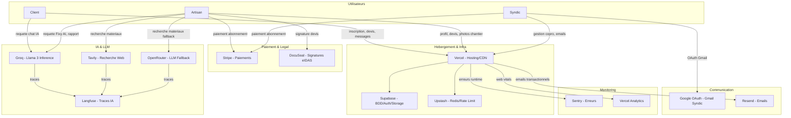

# Conformite RGPD des services tiers - Vitfix.io

> Derniere mise a jour : 6 avril 2026
> Responsable : Equipe produit Vitfix
> Frequence de revision : annuelle (prochaine : avril 2027)

---

## 1. Vue d'ensemble

Vitfix.io utilise **14 services tiers** pour son fonctionnement. L'audit RGPD identifie :

- **7 services conformes UE** (hebergement UE ou DPA signe avec clauses adequates)
- **4 services non-UE** necessitant des actions correctives
- **3 services intermediaires** a verifier

Tous les services doivent faire l'objet d'une verification DPA (Data Processing Agreement) formelle avant mise en production definitive. Ce document liste chaque service, son statut actuel et les actions requises pour atteindre la conformite RGPD complete.

Les trois types d'utilisateurs concernes :
- **Client** : particulier demandant un devis ou une intervention
- **Artisan** : professionnel du BTP inscrit sur la plateforme
- **Syndic** : gestionnaire de copropriete (B2B)

---

## 2. Matrice de conformite

| # | Service | Usage | Donnees partagees | Region | RGPD | DPA | Risque |
|---|---------|-------|-------------------|--------|------|-----|--------|
| 1 | **Supabase** | BDD, auth, stockage fichiers | Toutes donnees utilisateurs, fichiers, tokens | UE (Francfort) | Oui | Signe | Faible |
| 2 | **Vercel** | Hebergement, CDN, analytics | Logs HTTP, IP, metriques perf | US + Edge EU | Partiel | A verifier | Moyen |
| 3 | **Stripe** | Paiements, abonnements | Nom, email, IBAN/CB, montants | UE (Dublin) | Oui | Signe | Faible |
| 4 | **Groq** | Inference LLM (Llama 3) | Prompts contenant potentiellement PII | US | Non verifie | Absent | Eleve |
| 5 | **Tavily** | Recherche web (materiaux AI) | Requetes de recherche produit | US | Non verifie | Absent | Moyen |
| 6 | **OpenRouter** | LLM fallback (materiaux) | Prompts, requetes produit | US | Non verifie | Absent | Moyen |
| 7 | **Langfuse** | Observabilite IA, traces | Prompts, reponses, metriques | Cloud US ou self-hosted | A verifier | A verifier | Moyen |
| 8 | **Upstash** | Redis, rate limiting | IP, identifiants session | Configurable (US/EU) | A verifier | A verifier | Moyen |
| 9 | **Sentry** | Monitoring erreurs | Stack traces, IP, user agent, potentiel PII | US (SaaS) | Partiel | Signe | Moyen |
| 10 | **Google OAuth** | Connexion Gmail syndics | Email, nom, tokens OAuth | US | Oui | DPA Google Workspace | Faible |
| 11 | **Resend** | Envoi emails transactionnels | Email destinataire, contenu email | US | A verifier | A verifier | Moyen |
| 12 | **DocuSeal** | Signature electronique eIDAS | Nom, email, documents signes | UE | Oui | A verifier | Faible |
| 13 | **Vercel Analytics** | Metriques web vitals | Donnees navigation anonymisees | US + Edge | Partiel | Inclus Vercel DPA | Faible |
| 14 | **Vercel Speed Insights** | Performance monitoring | Metriques perf anonymisees | US + Edge | Partiel | Inclus Vercel DPA | Faible |

### Legende risque

- **Faible** : DPA signe, region UE, pas de PII non chiffree
- **Moyen** : DPA absent ou region US, mais donnees limitees ou anonymisables
- **Eleve** : PII potentielle transmise sans DPA vers juridiction non-UE

---

## 3. Flux de donnees



---

## 4. Actions requises par service

### 4.1. Groq - Inference LLM

**Risque : Eleve**

Groq heberge ses serveurs aux US sans engagement RGPD clair. Les 10 agents IA de Vitfix envoient des prompts pouvant contenir des PII (noms, adresses, descriptions de travaux).

**Actions :**
1. Contacter Groq pour obtenir un DPA signe avec SCC (Standard Contractual Clauses)
2. Si DPA impossible : recueillir le consentement explicite des utilisateurs avant toute interaction IA
3. Implementer l'anonymisation des prompts avant envoi (remplacer noms, adresses, telephones par des tokens)
4. Documenter dans la politique de confidentialite que les donnees transitent par un prestataire US
5. **Echeance : 30 jours**

### 4.2. Tavily - Recherche web IA

**Risque : Moyen**

Utilise par l'agent Materiaux AI pour rechercher des produits. Les requetes peuvent contenir des descriptions de chantier.

**Actions :**
1. Verifier les ToS de Tavily concernant la retention des donnees
2. Minimiser les donnees envoyees : ne transmettre que le nom du materiau, pas le contexte chantier
3. Ajouter un filtre pre-envoi qui retire toute PII des requetes de recherche
4. **Echeance : 45 jours**

### 4.3. OpenRouter - LLM Fallback

**Risque : Moyen**

Provider LLM de secours pour l'agent materiaux. Agit comme proxy vers plusieurs modeles.

**Actions :**
1. Verifier les ToS d'OpenRouter sur le stockage des prompts
2. Appliquer le meme filtre d'anonymisation que pour Groq
3. Verifier quel sous-traitant LLM est utilise en pratique (donnees potentiellement retransmises)
4. **Echeance : 45 jours**

### 4.4. Langfuse - Observabilite IA

**Risque : Moyen**

Langfuse stocke les traces completes des interactions IA (prompts + reponses). En mode cloud, les donnees sont aux US.

**Actions :**
1. Option A (recommandee) : migrer vers Langfuse self-hosted sur un serveur UE
2. Option B : verifier si Langfuse propose une region UE et migrer
3. Dans les deux cas : configurer une retention maximale de 90 jours sur les traces
4. Activer le masquage PII dans la configuration Langfuse (`maskPii: true`)
5. **Echeance : 60 jours**

### 4.5. Upstash - Redis / Rate Limiting

**Risque : Moyen**

Upstash stocke les IP et identifiants de session pour le rate limiting. La region par defaut peut etre US.

**Actions :**
1. Verifier la region actuelle du cluster Redis dans le dashboard Upstash
2. Si region US : migrer vers la region `eu-west-1` (Upstash supporte l'UE)
3. Verifier et signer le DPA Upstash (disponible sur leur site)
4. Configurer un TTL court (1h max) sur les cles contenant des IP
5. **Echeance : 30 jours**

### 4.6. Sentry - Monitoring erreurs

**Risque : Moyen**

Sentry capture les stack traces et peut capturer des PII dans les breadcrumbs (emails, noms d'utilisateurs dans les URL, donnees de formulaire).

**Actions :**
1. Ajouter un filtre `beforeSend` dans la configuration Sentry pour retirer les PII :

```typescript
// sentry.client.config.ts
beforeSend(event) {
  if (event.request?.data) {
    delete event.request.data;
  }
  if (event.user) {
    delete event.user.email;
    delete event.user.username;
  }
  return event;
}
```

2. Activer le scrubbing IP dans les parametres Sentry (Project Settings > Security & Privacy)
3. Configurer la retention a 30 jours (minimum propose par Sentry)
4. **Echeance : 15 jours**

### 4.7. Google OAuth - Integration Gmail Syndics

**Risque : Faible**

Utilise uniquement par les syndics pour connecter leur boite Gmail. Le consentement OAuth est deja explicite, mais la documentation doit etre formalisee.

**Actions :**
1. Documenter dans la politique de confidentialite l'utilisation de Google OAuth
2. Preciser les scopes demandes et leur justification
3. Ajouter un ecran de consentement explicite cote Vitfix avant la redirection OAuth
4. Verifier que les tokens OAuth sont chiffres au repos (ENCRYPTION_KEY dans .env)
5. **Echeance : 30 jours**

### 4.8. Resend - Emails transactionnels

**Risque : Moyen**

**Actions :**
1. Verifier le DPA de Resend (disponible sur resend.com/dpa)
2. Signer le DPA si disponible
3. Minimiser le contenu des emails (pas de donnees financieres dans le corps)
4. **Echeance : 30 jours**

---

## 5. Clauses Contractuelles Types (SCC)

Les transferts de donnees vers les US necessitent des SCC conformement a la decision Schrems II (CJUE, juillet 2020). Le EU-US Data Privacy Framework (DPF) peut couvrir certains cas si le prestataire est certifie.

| Service | Transfert US | DPF Certifie | SCC Requis | Statut |
|---------|-------------|-------------|------------|--------|
| Groq | Oui | Non verifie | Oui | A signer |
| Tavily | Oui | Non verifie | Oui | A signer |
| OpenRouter | Oui | Non verifie | Oui | A signer |
| Langfuse (cloud) | Oui | Non verifie | Oui | A signer (ou self-host) |
| Sentry | Oui | Oui (verifie) | Non si DPF valide | Verifier certification |
| Vercel | Oui (partiel) | Oui | Non si DPF valide | Verifier DPA Vercel |
| Resend | Oui | Non verifie | Oui | A signer |
| Google | Oui | Oui | Non si DPF valide | Couvert par DPA Google |

**Procedure pour les SCC :**
1. Utiliser le modele SCC de la Commission Europeenne (decision 2021/914)
2. Remplir l'Annexe I (parties, description du traitement)
3. Remplir l'Annexe II (mesures techniques et organisationnelles)
4. Faire signer par le responsable legal de chaque prestataire
5. Archiver les SCC signees dans un dossier RGPD centralise

---

## 6. Strategie de sortie

Pour chaque service critique, un plan de migration doit exister en cas de changement de conditions, de tarification abusive ou de non-conformite RGPD.

### 6.1. Supabase vers PostgreSQL self-hosted

- **Declencheur** : changement de prix, region UE retiree, incident securite
- **Migration** : export `pg_dump` complet, deploiement PostgreSQL sur Hetzner/OVH (UE)
- **Auth** : migrer vers NextAuth.js ou Lucia
- **Storage** : migrer vers MinIO self-hosted ou Cloudflare R2
- **Effort estime** : 2-3 semaines
- **Donnees a migrer** : toutes les tables, policies RLS, buckets storage

### 6.2. Stripe vers autre PSP

- **Alternatives** : Adyen (NL, natif UE), Mollie (NL), GoCardless (prelevement SEPA)
- **Migration** : exporter les clients et abonnements via API Stripe, recreer les subscriptions
- **Point d'attention** : les mandats SEPA ne sont pas portables, il faudra les recueillir a nouveau
- **Effort estime** : 3-4 semaines

### 6.3. Groq vers autre fournisseur LLM

- **Alternatives** : Anthropic Claude (API), OpenAI GPT-4, modele self-hosted (Llama 3 sur vLLM)
- **Migration** : l'architecture actuelle (fetch + circuit breaker dans `lib/groq.ts`) facilite le changement de provider
- **Self-hosted** : deployer Llama 3 70B sur GPU dedied (Hetzner, OVH) via vLLM ou Ollama
- **Point d'attention** : recalibrer les prompts des 10 agents pour le nouveau modele
- **Effort estime** : 1-2 semaines (API), 3-4 semaines (self-hosted)

### 6.4. Vercel vers Cloudflare Pages

- **Statut** : migration deja planifiee (domaine vitfix.io)
- **Etapes** : adapter le build Next.js pour `@cloudflare/next-on-pages`, migrer les variables d'environnement, configurer les workers pour les API routes
- **Avantage** : reseau edge UE natif, pas de transfert US pour les pages statiques
- **Effort estime** : 1-2 semaines

### 6.5. Langfuse vers self-hosted

- **Image Docker** : `langfuse/langfuse:latest`
- **Deploiement** : serveur UE (Hetzner, Scaleway), PostgreSQL dedie
- **Migration** : exporter les traces via API, reimporter dans l'instance self-hosted
- **Effort estime** : 2-3 jours

### 6.6. Resend vers alternative

- **Alternatives** : Postmark (meilleure delivrabilite), Amazon SES (cout), Brevo (FR, natif UE)
- **Avantage Brevo** : entreprise francaise, serveurs UE, conformite RGPD native
- **Effort estime** : 1 semaine

---

## 7. Calendrier de revision

### Revision annuelle (avril de chaque annee)

| Action | Responsable | Frequence |
|--------|-------------|-----------|
| Audit complet de tous les DPA signes | DPO / Legal | Annuelle |
| Verification des certifications DPF des prestataires US | DPO / Legal | Annuelle |
| Revue des donnees partagees avec chaque service | Equipe technique | Annuelle |
| Test du plan de sortie pour les services critiques | CTO | Annuelle |
| Mise a jour de ce document | Equipe produit | Annuelle |
| Verification des SCC signees (validite, mise a jour modele CE) | DPO / Legal | Annuelle |

### Revisions declenchees par evenement

- **Nouveau service tiers ajoute** : audit RGPD avant integration, ajout a ce document
- **Changement de ToS d'un prestataire** : revue dans les 15 jours
- **Incident de securite chez un prestataire** : revue immediate, activation plan de sortie si necessaire
- **Nouvelle reglementation** (ex : ePrivacy Regulation, AI Act) : revue dans les 30 jours
- **Changement de region d'hebergement** : verification DPA et SCC

### Prochaines echeances

| Echeance | Action | Priorite |
|----------|--------|----------|
| Avril 2026 (J+15) | Filtre PII Sentry `beforeSend` | Haute |
| Avril 2026 (J+30) | DPA Groq ou consentement explicite + anonymisation | Critique |
| Avril 2026 (J+30) | Verification region Upstash, migration EU | Haute |
| Avril 2026 (J+30) | DPA Resend, consentement Google OAuth | Moyenne |
| Mai 2026 (J+45) | Audit ToS Tavily + OpenRouter, filtre PII | Moyenne |
| Juin 2026 (J+60) | Migration Langfuse self-hosted EU | Moyenne |
| Avril 2027 | Revision annuelle complete | Standard |

---

## Annexe : checklist DPA

Pour chaque service, le DPA doit contenir au minimum :

1. Description du traitement (finalite, categories de donnees, categories de personnes)
2. Duree du traitement et politique de retention
3. Obligations du sous-traitant (securite, confidentialite, notification de violation)
4. Droits d'audit du responsable de traitement
5. Conditions de sous-traitance ulterieure
6. Procedure de suppression/restitution des donnees en fin de contrat
7. Clauses SCC si transfert hors UE (Annexes I et II du modele CE 2021/914)
